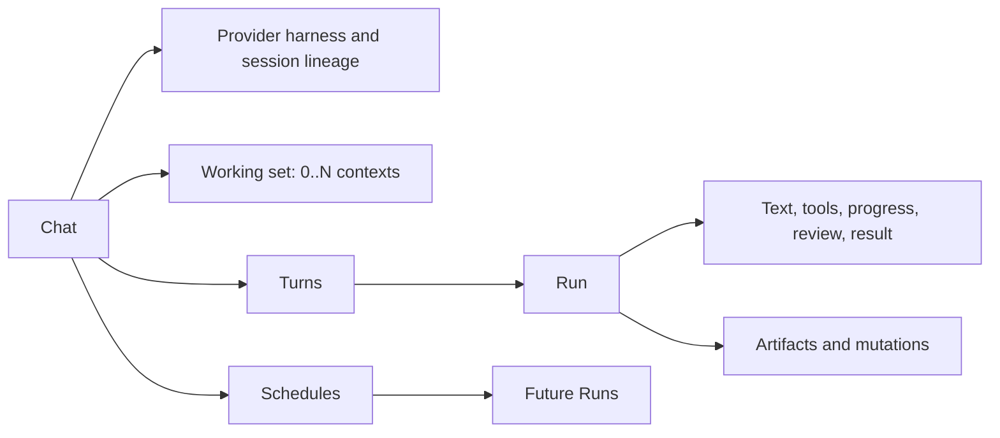

# Ralphy Desktop Agent Chat — UI Design Handoff

## Purpose

Design Agent Chat as the persistent execution surface for Ralphy: a provider-native harness where creators can direct AI agents while keeping the content they are producing visible.

Ralphy began as a harness around coding-agent environments. The desktop product should preserve that power instead of reducing Claude Code, Codex, OpenRouter, OpenCode, Qwen Code, and future runtimes to a generic chatbot skin.

The product promise is:

> Keep the work in view, choose the agent environment you already trust, and run several content-production sessions without losing context or control.

Agent Chat is where intent turns into projects, Units, revisions, renders, research, and scheduled work. It is not a social inbox and not a separate content destination.

## Settled product decisions

- Chat remains in the existing right-side panel.
- There is no separate top-level `Chats` page in this design.
- Chat is a global agent session. It is not owned by one workspace or project.
- One chat may work with zero, one, or many workspaces, projects, Units, artifacts, and Marketplace items.
- Several chats may run in parallel.
- A chat uses one provider harness and one provider session lineage at a time.
- Provider-specific authentication, models, tools, permissions, session resume, cost, and errors remain visible.
- Scheduled jobs may be created from a chat and produce future Runs.
- The main workspace/project/Marketplace content stays visible while chat is open.
- Do not reserve permanent bottom-screen space for a Status Bar in the first design.

## Product position

The desktop application has four layers:

```text
Workspaces   organize brand context and production objects
Marketplace supplies reusable community capabilities
Agent Chat  executes work through provider-native harnesses
Activity    records runs, artifacts, review needs, and schedules
```

Agent Chat is a system layer that can operate on the other layers. It should feel closer to a capable IDE agent panel than to a consumer messenger.

## Ideal chat experience

The ideal Ralphy chat lets a creator move from an idea to a finished content artifact without hiding the work or forcing the user to learn the underlying filesystem.

A user should be able to:

- type or dictate an instruction;
- mention a workspace entity inline with `@`;
- attach selected Units, revisions, assets, documents, Marketplace items, or local files;
- choose the provider harness and model they already use outside Ralphy;
- inspect and change the agent's working set and permissions;
- start a Run while other chats continue in parallel;
- see meaningful tool progress without reading raw protocol logs;
- approve consequential actions at the moment they matter;
- open generated Units, revisions, renders, and documents in the main canvas;
- schedule a future Run from the same chat;
- return later through searchable chat history and resume the provider-native session;
- understand which provider, model, context, tools, and versions produced an output.

The experience should remain useful at three levels of sophistication:

1. **Simple request** — type or speak, send, receive a useful result.
2. **Contextual production** — attach Ralphy entities, review tool activity, and open outputs.
3. **Power-user orchestration** — manage providers, permissions, concurrent sessions, schedules, retries, forks, and technical details.

Progressive disclosure is essential. The first level must stay calm even though the deeper capabilities exist.

## Placement and visibility

The panel is available on production surfaces:

- workspace Overview;
- Projects;
- Units;
- Calendar;
- Shared Library;
- Memory;
- project Documents and Media;
- Marketplace browse and detail.

It may remain hidden on onboarding, migration recovery, and full application Settings where it would compete with setup or recovery work.

Recommended desktop geometry follows the current workbench:

- default width: approximately 336 px;
- resizable range: approximately 280–520 px;
- a visible resize handle;
- close/collapse without ending active Runs;
- main canvas reflows rather than being permanently obscured at normal desktop widths.

At narrow widths, the panel may temporarily overlay the main canvas. It must offer a clear close action and preserve the main page state underneath.

## No mandatory bottom Status Bar

The first design should not add a persistent bottom bar merely to expose chat status.

When the panel is closed, use the existing right-panel control as the compact status affordance:

- neutral icon — no active work;
- spinner plus count — one or more Runs active;
- attention badge — a chat needs review or input;
- scheduled indicator — an upcoming job exists;
- completion notification — background work finished.

The control's tooltip and accessible label name the state, for example `Agent panel · 2 running · 1 needs review`.

A permanent bottom bar can be reconsidered only if usability testing shows that this compact indicator is insufficient.

## Current interface audit and first redesign

The current right panel already establishes the correct structural foundation:

- the main project content remains visible;
- the panel is resizable and collapsible;
- the composer is anchored at the bottom;
- provider, model, and permission controls are available without leaving the conversation;
- the visual language is restrained and consistent with the workbench.

Preserve those decisions. Improve the hierarchy and usefulness of the panel rather than replacing it.

### Problems visible in the current empty state

- The current project name appears as passive subtitle and placeholder text, so its role as agent context is unclear.
- A large empty area repeats `What should we work on?` without helping the user start a contextual task.
- Chat selection and parallel-session status are not visually obvious.
- Header actions depend on small icons whose meaning is difficult to infer without tooltips.
- Provider/model identity is repeated in the header and composer without adding status information.
- There is no visible affordance for attaching the current view, selected media, or another Ralphy entity.

### First redesign priorities

1. Add a compact `Working with` strip below the header.
2. Replace the passive empty state with two or three suggestions based on the visible page and selection.
3. Make the chat title a clear session picker with Running, Needs review, Scheduled, Recent, and Archived groups.
4. Use the header subtitle for provider status such as `Codex · Ready` or `Claude · Working 01:24`.
5. Add one attachment/context action to the composer.
6. Surface background work through the existing panel control and chat picker, not a permanent Status Bar.
7. Render tool progress, approvals, and created artifacts as first-class timeline elements.

### Contextual empty state

The empty state should demonstrate that Ralphy understands the current page.

Example on a project's Media page:

```text
What should we make from this media?

[Analyze the visual direction]
[Turn selected assets into a Unit]
[Create a content concept]
```

Examples adapt by surface:

- Unit — review the selected revision, suggest improvements, or create another version;
- Calendar — plan the next week, fill a gap, or adapt a Unit for another channel;
- Shared Library — organize assets, describe them for future agents, or find usage;
- Marketplace — explain the item, check compatibility, or use it in a named project;
- Memory — inspect effective context or draft a proposed memory;
- Workspace Overview — summarize attention items or plan the next production work.

Show at most three suggestions. They insert an editable prompt; they do not execute immediately.

## Core domain model



### Chat

A durable human-agent conversation with:

- title;
- provider harness;
- model;
- provider session ID or resume token;
- permission mode;
- working set;
- turns and Runs;
- schedules;
- created/updated timestamps;
- archived state.

### Working set

The explicit collection of resources an agent may use as context:

- workspaces;
- projects;
- Units and revisions;
- Documents;
- Shared Library artifacts;
- Marketplace items and pinned versions;
- local files or folders when explicitly attached.

### Turn

One user instruction and the agent response lineage associated with it.

### Run

One execution attempt for a Turn. A retry creates another Run rather than rewriting history.

### Schedule

A durable trigger that creates a future Run from a pinned instruction and execution configuration.

### Output

Any artifact, revision, project mutation, publication draft, file, or structured result produced by a Run.

## Provider-native architecture

The UI should normalize only what is genuinely shared and preserve the capabilities of each harness.

Target harness examples:

- Claude Code SDK or CLI;
- Codex SDK or CLI;
- OpenRouter-backed execution;
- OpenCode SDK;
- Qwen Code;
- future local or remote agent runtimes.

The exact installed providers may differ by machine. The UI reads capability metadata instead of hard-coding identical controls for every provider.

### Shared provider capabilities

Where supported, a provider exposes:

- connection and authentication state;
- available models;
- session start/resume;
- streaming text;
- tool calls;
- stop/cancel;
- permission modes;
- token, cost, or duration metadata;
- structured errors;
- background-process support.

### Provider-specific capabilities

Examples include:

- Claude subscription login versus Anthropic API key;
- Codex account login and sandbox/approval behavior;
- OpenRouter API key, model routing, and provider attribution;
- OpenCode runtime configuration;
- Qwen Code authentication and model selection;
- different tool names, context limits, and resume semantics.

Do not rename distinct provider modes into one fictional universal mode. Use a stable product-language summary and expose provider-specific detail when it affects behavior.

## Chat and provider relationship

One chat uses one provider harness and session lineage.

Switching provider after a chat has begun should create a new chat or explicit fork:

> Continue as a new Codex chat with the current working set and a summary of this conversation?

This prevents the interface from implying that one provider can resume another provider's native session.

Changing models within a provider follows that provider's rules:

- allow before the first Turn when safe;
- allow mid-chat only if the provider supports it;
- otherwise offer `Fork with model`;
- always show which model produced each completed Run when models changed.

## Panel anatomy

```text
┌──────────────────────────────────────────┐
│ Chat picker       Provider · Model   + × │
├──────────────────────────────────────────┤
│ Working with: [Snickers] [Unit 024] [+]  │
├──────────────────────────────────────────┤
│                                          │
│ Conversation                             │
│ Tool activity                            │
│ Review requests                          │
│ Output cards                             │
│                                          │
├──────────────────────────────────────────┤
│ Message…                                 │
│ Attach  Schedule  Mode  Model      Send  │
└──────────────────────────────────────────┘
```

The panel has four stable regions:

1. **Session header** — chat selection, provider state, new chat, and close.
2. **Working-set strip** — explicit context and context management.
3. **Timeline** — messages, tool events, review requests, and outputs.
4. **Composer** — prompt plus provider-supported execution controls.

Do not add permanent tabs for every secondary concept. Use progressive disclosure for Runs, Schedules, technical logs, and chat management.

## Session header

The header must answer:

- which chat is open;
- whether it is running, idle, waiting, scheduled, complete, or failed;
- which provider harness and model it uses;
- whether the provider is connected;
- how to start or switch chat;
- how to collapse the panel.

Recommended layout:

- left: provider mark and chat picker;
- center or secondary line: provider, model, and status;
- right: `New chat`, overflow menu, collapse/close.

Do not place several chat tabs across a 336 px panel. They will truncate immediately. Use a picker with status-aware grouping.

## Chat picker and session management

Opening the chat picker shows:

- search;
- `New chat`;
- Running;
- Needs review;
- Scheduled;
- Recent;
- Archived.

Every chat row shows:

- title;
- provider mark and model;
- compact working-set summary;
- status text and icon;
- last update;
- next schedule when relevant.

Users can switch away from a running chat. Its Run continues and remains visible in the picker's `Running` group.

Row actions:

- Open
- Rename
- Duplicate or fork
- Schedule
- Archive
- Stop current Run, when running
- Delete, only with clear history/output impact

Archive removes clutter without deleting provider session identifiers, Runs, or provenance.

### History experience

History lives behind the chat picker; it does not require a separate top-level Chats page. When the library grows beyond a short menu, the picker may widen into a searchable popover or temporary drawer while the main canvas remains visible.

History supports:

- full-text search across titles, user and agent messages, referenced entities, and named outputs;
- filters for status, provider, model, workspace, project, and date;
- `Running`, `Needs review`, `Scheduled`, `Pinned`, `Recent`, and `Archived` groups;
- a matching message snippet and `Jump to message` for search results;
- rename, pin, archive, export, fork, and delete actions;
- unread completion, failure, and review indicators;
- restoration of the selected chat, timeline position, and per-chat draft after restart.

Generate a useful title from the first request, but keep it editable. A fork shows its parent chat and originating message. Retry and `Edit and retry` create a new Run branch rather than silently replacing history.

Deletion must explain separately what happens to the Ralphy index, provider transcript, schedules, and generated outputs. Active schedules must be paused, moved, or explicitly deleted before their owning chat is removed.

## Working set and context behavior

Chat is global and may reference multiple contexts.

Example:

```text
Working with
[Snickers workspace] [Summer Campaign] [Unit 024 r3]
[Kinetic Title component v1.4] [+ Add]
```

### Creating a chat from content

When the user starts a new chat from a workspace, project, Unit, artifact, or Marketplace item:

- suggest the current object and its parent workspace/project as initial context;
- show the suggestion before the first Turn;
- allow removing it;
- pin the selected revision or item version when reproducibility matters.

### Navigating while an existing chat is open

Navigation must not silently rewrite an existing chat's working set.

When the visible page changes, the composer may offer:

> Add current Unit 031 to this chat

The user chooses whether to add it. The panel continues showing the current chat even when its working set differs from the visible page.

### Execution snapshot

Each Run records a snapshot of:

- working-set references and revisions;
- provider and model;
- permission mode;
- prompt;
- installed Marketplace item versions;
- relevant workspace memory revision or compact context reference.

This makes results explainable and reproducible even if context changes later.

### Turn attachments and inline entity mentions

Use two explicit context scopes:

- **Working set** — persists for future Turns in this chat;
- **Turn attachments** — apply only to the next Turn unless promoted with `Keep in chat`.

Typing an inline `@mention` creates a Turn attachment by default. The rendered mention remains readable and linked after send; it is not flattened into ambiguous text. Dragging an object from the canvas or sidebar, choosing `Attach selected`, choosing `Add current view`, pasting a file, and using the composer `+` button all lead to the same attachment shelf.

Supported workspace entities should include:

- workspace and project;
- Unit and a pinned Unit revision;
- document;
- media or generated artifact;
- Shared Library item;
- reviewed Memory entry or collection;
- calendar event, social account, and publication draft;
- Marketplace item and pinned version;
- local model;
- local file or folder when the provider and permission scope allow it.

The `@` autocomplete is a keyboard-accessible combobox grouped by `Current view`, `Recent`, `Workspaces`, `Projects`, `Units`, `Shared Library`, and `Marketplace`. Search names, IDs, and tags. Every result shows type, parent context, and a small preview where useful. Arrow keys move, Enter inserts, and Escape closes without losing the draft.

Attachment chips expose type, name, pinned revision/version, remove, and `Keep in chat`. Hover or keyboard focus opens a compact inspector. Missing, moved, incompatible, permission-denied, and outdated references remain visible with a recovery action.

Do not silently attach an entire page such as all 38 visible Media items. Represent the current page, explicit selection, or collection query as a stable reference and show what will be resolved at Run start. Deduplicate repeated references, warn near provider context limits, and require permission validation before sending. Each Run stores the resolved IDs and revisions used.

## New chat flow

Keep the flow compact inside the panel.

1. Choose provider harness.
2. Confirm connection or authenticate.
3. Choose model when the provider exposes a choice.
4. Review suggested working set.
5. Choose permission mode.
6. Write the first instruction.

Remember the user's last valid provider and model, but do not carry credentials, unavailable models, or high-risk unattended permissions into an incompatible provider.

If a provider is unavailable, keep it visible with a concrete setup action:

- `Install Claude Code`;
- `Sign in to Codex`;
- `Add OpenRouter API key`;
- `Configure OpenCode`;
- `Connect Qwen Code`.

## Provider and model picker

The provider picker is status-first, not a brand carousel.

Each provider row shows:

- official provider mark;
- harness name;
- installed/available state;
- authentication source;
- current connection issue;
- capabilities relevant to chat.

The model picker shows only models reported by the selected harness or configured router. Include:

- model name and provider/model ID;
- context or capability summary when known;
- local/remote source;
- cost indicator only when trustworthy;
- unavailable or deprecated state;
- current default.

Search long model lists. Do not load hundreds of OpenRouter entries into an unfiltered menu.

### Provider management

Separate the quick picker from provider configuration. The composer picker chooses among connected harnesses; `Manage providers` opens a settings sheet or the existing Settings surface. Never place credential forms inside the normal composer.

Provider management covers Codex, Claude Code, OpenCode, OpenRouter, Qwen Code, and future adapters through reported capabilities rather than one lowest-common-denominator form. Each provider detail shows:

- harness name, adapter version, and executable/runtime health;
- connection or authentication source;
- available and default models;
- supported tools, context types, permissions, resume, scheduling, and concurrency;
- working directory and environment scope where applicable;
- global default and optional workspace default;
- `Test connection`, `Reconnect`, `Update`, and provider-specific setup actions.

Secrets use secure system storage. Show only a redacted key and its source, such as `Keychain`, `Environment`, or `Provider login`; never echo a complete token into the renderer or transcript. A workspace default may override a global default only when the UI states that clearly.

OpenRouter is a model router and catalog, not automatically equivalent to a native coding harness. Its adapter must declare which agent loop, tools, and permissions actually execute a Run. Disabled capabilities include a plain-language reason.

Changing model within a provider follows that provider's resume rules. Changing provider after a chat has started creates a new chat or explicit fork with copied context because one harness cannot resume another harness's native session lineage.

## Permission modes

Use capability-based product language with provider detail.

Recommended shared summaries:

- **Plan** — inspect and propose without making changes;
- **Ask before changes** — allow safe work and request approval for consequential actions;
- **Full access** — run allowed tools within the configured environment without per-action approval.

Map these summaries to provider-native settings. When a provider cannot support a mode, disable it with an explanation.

Before a Run begins, users must be able to inspect:

- filesystem scope;
- network access;
- shell/tool access;
- workspace/project targets;
- provider credential source;
- whether the Run can publish, delete, spend money, or mutate external systems.

Do not hide permission state inside a generic settings menu.

## Composer

The composer supports:

- an auto-growing multiline prompt with a bounded maximum height;
- an attachment shelf for entities, files, images, video, and audio;
- inline `@entity` mentions and searchable attachment picker;
- paste, drag-and-drop, `Attach selected`, and `Add current view`;
- voice dictation;
- provider, model, and permission access;
- schedule and secondary actions in an overflow menu until usage justifies permanent controls;
- send while idle and stop while running;
- a concrete explanation when another Run in this chat blocks a new Turn.

Recommended control order is `+`, prompt, microphone, execution controls, and send/stop. Provider, model, and permission values may appear in the composer footer; do not repeat the same values as equally prominent controls in the header. Keep the attachment shelf above the prompt so the user can verify exactly what will be sent.

Pasted or dropped files show type, size, upload/indexing state, preview when useful, remove, and failure recovery. A file is never treated as trusted executable context merely because it was attached. Unsupported types remain named and explain what the provider can or cannot do with them.

Slash commands such as `/schedule`, `/attach`, or `/new` may exist only when they map to real product actions. Show autocomplete and a short description; do not turn ordinary prompting into a command language.

Show context usage only when it helps: a subtle estimate near the provider limit, then a concrete warning that identifies large attachments and offers removal or a new chat. Do not expose a precise token promise when the harness cannot provide one.

### Voice input

The microphone is dictation, not an alternate automatic-send mode.

States:

- Permission needed
- Listening
- Paused
- Transcribing
- Ready to edit
- Failed

Click starts and stops recording. While listening, show recording text, duration, a restrained waveform or level meter, pause, cancel, and finish. The state must remain understandable without color or waveform motion. Do not require press-and-hold.

Transcription is inserted into the current draft and remains editable before send. Existing attachments and inline mentions remain intact. Offer language auto-detection with an optional explicit language in the microphone menu. State whether transcription is local or sent to a remote service, and identify the service before first use.

Raw audio is discarded after successful transcription by default. If the user deliberately chooses `Attach recording`, it becomes a normal audio attachment with its own retention and permission behavior. On transcription failure, preserve the recording temporarily and offer `Retry`, `Download`, or `Delete`; never lose it behind a generic error.

Microphone permission denial provides a direct recovery path. Escape cancels recording, keyboard controls have visible focus and accessible names, and screen readers receive restrained state announcements rather than continuous waveform updates.

Keyboard behavior:

- Enter sends;
- Shift+Enter creates a new line;
- sending is disabled with an explanation when provider, permission, or context setup is incomplete;
- IME composition never triggers accidental send.

Drafts, attachment selections, and unfinished transcription persist per chat where safe. Switching chats or closing the panel must not discard unsent work. Editing a sent user message creates an explicit fork or new Run branch and does not rewrite the historical record.

## Timeline and tool activity

The timeline mixes conversational text with production events without becoming a raw terminal log.

### User and agent messages

- Stream agent text as it arrives.
- Render safe Markdown, code blocks with copy, tables, citations, links, images, video, audio, files, diffs, and workspace-entity references.
- Show provider/model attribution at the Run level rather than repeating it on every text fragment.
- User actions: copy, edit and fork, and reuse in a new chat.
- Agent actions: copy, retry, fork, feedback, and open cited sources.
- Keep timestamp, duration, token, and cost detail available without placing metadata under every short message.
- Never expose hidden chain-of-thought. Show concise decisions, plans, and tool activity that help the user understand or intervene.
- Sanitize arbitrary HTML and never execute scripts from provider output.

Retry creates another Run branch and keeps the failed or disliked result. A completed Run ends with a compact summary containing provider/model, duration, trustworthy usage/cost when available, tools used, outputs created, context snapshot, and retry/fork actions.

### Tool calls

Tool start, progress, result, and failure events update one evolving timeline node; they must not produce four disconnected rows. Normalize provider-specific event names into a semantic `uiKind`, while preserving raw provider payload under technical details.

Use the least prominent renderer that still helps the user:

1. **Hidden protocol event** — token chunks, heartbeats, transport acknowledgements, and internal reasoning are not separate timeline items.
2. **Compact status line** — read, list, lookup, metadata inspection, and other fast reversible operations.
3. **Expandable technical row** — shell commands, web fetches, tests, lint, or file operations whose details may explain a result.
4. **Progress block** — generation, render, download, install, upload, transcode, export, or another meaningful long-running operation.
5. **Result or entity card** — a created Unit, revision, document, render, media artifact, publication, schedule, or Marketplace fork.
6. **Diff card** — material edits to a document, composition, code, configuration, or structured entity.
7. **Approval card** — publish, delete, overwrite, install untrusted code/model, use credentials, incur paid generation, or mutate an external system.
8. **Error and recovery card** — a failed step with preserved output and actionable recovery.
9. **Question or choice card** — structured user input needed before the Run can continue.

Recommended mapping:

| Tool intent | Default renderer | Required visible information |
|---|---|---|
| Read, list, metadata, memory lookup | Compact line; group repetitions | Intent, target summary, count, pass/fail |
| Search workspace or web | Compact line; source bundle when evidence matters | Query, result count, cited sources |
| Shell command | Expandable row | Human intent, status, command under details, exit code |
| Tests, lint, validation | Compact pass/fail; expand failures | Suite, counts, duration, failing items |
| Image, video, or audio generation | Progress block, then preview card | Model, stage, honest progress, output, failure recovery |
| HyperFrames, FFmpeg, or export render | Progress block, then render card | Target Unit/revision, stage, format, output preview |
| File, document, composition, or code edit | Diff card | Target, changed sections/files, summary, inspect action |
| Create Unit or revision | Entity card | Preview, state, parent project, revision, open action |
| Schedule or calendar mutation | Structured schedule card | Timezone, recurrence, target, next Run, edit/pause |
| Publish to a social account | Approval, then publication result | Account, content preview, time, external impact, resulting URL/status |
| Download/install model, Skill, or recipe | Progress plus trust/compatibility card | Source, version, license, size, permissions, destination |
| Delete, overwrite, move, or destructive conversion | Approval card | Exact targets, reversibility, impact, scoped approval |
| Provider authentication or reconnect | Inline blocking card | Provider, reason, safe setup/reconnect action |
| Delegated agent or subtask | Child Run row | Objective, provider, status, review need, open child trail |
| Request for user decision | Question/choice card | Why needed, options, consequences, free-form escape hatch |

Compact examples:

```text
✓ Read 8 project files
● Rendering Unit 024 · 43%
! Approval needed · Publish 3 posts
× FFmpeg failed · View recovery
```

Group consecutive repetitive operations such as `Read 18 files` or `Searched 4 sources`, with failed or consequential children promoted. Human-readable intent comes first. `Technical details` may include tool name, provider event ID, start time, duration, normalized status, command, paths, redacted inputs, stdout/stderr, retry, and copy actions.

Never show secret values, full credentials, or sensitive environment variables. Do not invent percentage or ETA when the tool reports only an indeterminate state. Status always uses text and icon in addition to color. Progress updates should not flood screen-reader live regions.

Result cards are links into Ralphy's domain model, not decorative chat attachments. Their primary action opens the full object in the main canvas while the chat remains available. A diff card opens the appropriate compare/revision surface. Source bundles preserve citation URLs, titles, retrieval time, and which claim used them.

### Review requests

When an agent needs a decision, show an inline review card with:

- what it wants to do;
- target;
- impact;
- evidence or preview;
- approve, change, or reject actions;
- timeout or schedule behavior when relevant.

Approval must be scoped to the named action. Avoid vague buttons such as `Allow everything` unless the user deliberately changes the chat's permission mode.

While a review is pending, the card remains attached to the paused Run and is discoverable from `Needs review`. After resolution, replace live controls with the recorded decision, actor, time, and resulting state so restart or chat switching cannot make the same action look unreviewed.

### Outputs

Generated outputs appear as compact linked cards:

- Unit or revision preview;
- document;
- render;
- scheduled publication draft;
- Marketplace fork;
- file or research artifact.

Primary action opens the object in the main canvas while keeping the chat available. Chat should not duplicate a full media browser inside the panel.

## Parallel execution

Target behavior:

- many chats may have active Runs concurrently;
- one chat has at most one mutating active Run unless its provider explicitly supports safe parallel branches;
- switching chats never stops background work;
- each Run has its own process/session handle and stop action;
- statuses update independently;
- completion and review needs surface even when the panel is closed.

Recommended states:

- Idle
- Queued
- Starting
- Running
- Waiting for approval
- Waiting for user
- Scheduled
- Completed
- Failed
- Cancelled
- Interrupted
- Reconnecting

Status uses icon plus text. Color is supplemental.

If concurrency limits are reached, show the actual queue and reason. Do not disable every composer with the unexplained message `Another agent is working`.

## Scheduling

A Schedule belongs to a chat and starts future Runs.

The schedule editor captures:

- name;
- instruction or selected reusable prompt;
- recurrence or one-time time;
- timezone;
- provider and model;
- working-set snapshot or explicit dynamic scope;
- permission policy;
- output destination;
- notification/review policy;
- next Run preview.

Schedule states:

- Active
- Paused
- Needs authentication
- Needs review
- Missed
- Running
- Failed
- Completed for one-time schedules

Unattended Runs require stronger review than interactive Runs. Do not silently reuse an unrestricted interactive permission mode for schedules. Publishing, destructive filesystem work, paid generation, or external mutations must have an explicit policy and recoverable audit trail.

The panel should show a chat's next schedule and last result. A larger schedule manager may exist elsewhere later, but is not required to design a separate Chats page now.

## Memory boundary

Chat history is not automatically Ralphy Memory.

- Chat contains transient conversation and execution history.
- Memory contains reviewed durable rules and facts reused by future agents.
- A completed chat may propose memory entries.
- Proposed memories remain reviewable before activation.
- Archiving or deleting a chat does not silently delete approved Memory entries.

When the agent uses workspace Memory, the Run should indicate that durable context was included and allow inspection through the Memory surface.

## Marketplace integration

Marketplace items may enter a chat working set through `Use in chat`.

The attachment includes:

- stable Marketplace item ID;
- type;
- pinned version;
- source and license;
- installed/available state;
- compatibility warnings;
- item-specific payload reference.

Chat may guide the user through required installation, but it must not bypass model license acceptance, Skill trust review, or project-target confirmation.

When a chat creates a local fork or derivative, preserve the source relationship.

## Session history and persistence

Chats must survive application restart.

Persistence includes:

- title and provider;
- model and provider session ID;
- working set;
- drafts;
- Runs and status;
- schedules;
- outputs and backlinks;
- last visible scroll position where practical;
- archive state.

Provider transcripts may remain canonical for provider-native session resume, but Ralphy needs its own durable index and execution metadata. Browser local storage alone is insufficient for schedules, parallel background processes, cross-device-safe recovery, or provenance.

On restart:

- completed history restores immediately;
- active local processes are reattached when possible;
- unknown process state becomes `Interrupted` or `Reconnecting`, not falsely `Running`;
- scheduled work reconciles missed triggers according to an explicit policy;
- stale authentication is surfaced without destroying the chat.

## Error and recovery states

### Provider not installed

Explain which harness is missing and provide the exact setup path. Preserve the draft and working set.

### Authentication expired

Keep history readable. Offer reconnect and retry without duplicating the Turn.

### Model unavailable

Explain whether the model was removed, renamed, gated, or temporarily unavailable. Offer compatible models or an explicit fork.

### Run failed

Show the failed step, preserved outputs, recovery recommendation, and `Retry`, `Edit and retry`, or `Fork` as appropriate.

### App closed during Run

After restart, reconcile provider/process state. Never show a perpetual spinner based only on the last saved UI state.

### Context missing

Name the missing workspace, project, file, revision, or Marketplace version. Allow removing, locating, or replacing it before retry.

### Conflicting mutations

When parallel chats target the same object, surface version conflict and offer review or a new revision. Do not let the last finishing Run silently overwrite another Run's work.

### Schedule could not run

Show missed time, cause, affected output, and next scheduled time. Let the user run now, skip, or pause.

## Accessibility and interaction

- The panel, resize handle, chat picker, timeline, tool disclosures, context chips, and composer are fully keyboard accessible.
- Resize has keyboard controls and an accessible value, not pointer-only dragging.
- Focus returns to the originating control after menus and sheets close.
- The `@mention` picker uses combobox/listbox semantics, announces result count, and preserves typed text when dismissed.
- Attachment chips can be inspected, pinned, and removed with a keyboard; removal returns focus predictably.
- File and entity previews expose names, types, captions or alt text, state, and parent context where relevant.
- Voice recording exposes `Listening`, duration, pause, transcription, and failure through text; waveform or color is never the only signal.
- New streaming content uses restrained live announcements; token-by-token screen-reader noise is avoided.
- Long-running tool progress announces meaningful stage changes, not every percentage update.
- Run status, provider connection, permission mode, and review need include text, not color alone.
- Tool disclosures use native expanded/collapsed semantics.
- Long provider names, model IDs, file paths, and chat titles wrap or expose their full value.
- Icon-only controls have accessible labels and tooltips.
- Focus indicators remain visible on dark surfaces.
- Panel transitions use approximately 150–300 ms, animate transform/opacity where possible, and respect reduced motion.
- Closing the panel does not move focus into hidden content.
- The timeline reading order matches the visual order even when tool details expand.

## Visual direction

Follow the existing Ralphy Desktop workbench: dark, restrained, dense, and content-first.

Use:

- provider marks as small identity anchors;
- text plus icon for operational states;
- compact context chips;
- calm message surfaces rather than oversized chat bubbles;
- collapsible tool rows;
- tabular figures for cost, tokens, duration, and progress;
- monospaced styling for commands, IDs, model names, paths, and raw output;
- one clear accent for the active Run and primary composer action;
- subtle dividers instead of nested cards around every message.

Avoid:

- consumer-messenger styling;
- mascot-heavy empty states after onboarding;
- huge provider logos;
- decorative typing animations;
- a rainbow of provider brand colors throughout the timeline;
- raw logs dominating normal use;
- permanent bottom UI that reduces the content canvas;
- hiding provider, model, context, or permission state to make the panel look simpler.

## Required design frames

1. Existing Media page with redesigned contextual chat empty state
2. Right panel — empty connected chat on a Unit, Calendar, and Marketplace page
3. Provider setup — Claude Code, Codex, OpenCode, OpenRouter, and Qwen Code capability variants
4. Provider manager — connection health, defaults, permissions, models, and secure credential source
5. New chat — provider, model, suggested working set, and permission mode
6. Attachment picker — mixed workspace entities and local files
7. Inline `@mention` autocomplete and inserted entity token
8. Composer with mixed entity, image, video, audio, and file attachments
9. Voice states — permission, listening, transcribing, editable transcript, and failure recovery
10. Active conversation with streaming text, Markdown, citations, and media
11. Working set with several workspaces, projects, Units, revisions, and Marketplace items
12. Turn attachments promoted to `Keep in chat`
13. Current page differs from chat context — `Add current view`
14. Context near provider limit and missing/outdated entity recovery
15. History search — snippets, filters, pinned, archived, and jump to message
16. Chat picker — several parallel Running, Scheduled, and Needs review chats
17. Background chat completes while another chat is open
18. Compact grouped reads/searches with expanded technical details
19. Generation/render progress followed by an output preview card
20. Diff card for a Unit composition or document revision
21. Inline approval request for publish/delete/install with exact impact
22. Structured question/choice card that pauses a Run
23. Delegated child agent/subtask with linked execution trail
24. Run completion summary with provenance, outputs, and retry/fork
25. Output cards linking to Unit revisions, Documents, Media, and Calendar
26. Provider switch — explicit new chat/fork flow
27. Model unavailable and authentication-expired recovery
28. Run failure with preserved partial outputs and retry options
29. Schedule editor and next-run preview
30. Schedule needs authentication or missed a Run
31. Panel collapsed with running/attention badge on the existing panel control
32. Narrow desktop overlay behavior
33. Keyboard resize, focus, screen-reader labels, and reduced-motion states
34. App restart — interrupted and reconnected Runs

## Existing implementation to preserve

The current desktop implementation already provides useful foundations:

- right-side `AgentChatPanel` integrated with the workbench;
- resizable and collapsible right panel;
- multiple locally persisted chat records;
- Claude, Codex, and OpenRouter provider selection;
- provider model selection;
- Claude subscription and API-key paths;
- Codex login;
- OpenRouter API-key storage;
- permission modes;
- provider session resume IDs;
- streaming text;
- tool start/result events;
- stop action;
- cost result where reported;
- project context passed to the provider run.

The design should evolve this panel instead of creating an unrelated second chat surface.

## Current limitations the design must not misrepresent

As of this handoff, the current desktop path has important limitations:

- only Claude, Codex, and OpenRouter are represented in the active UI types;
- one global `agentTurnBusy` gate allows only one active agent Run across all chats;
- one `activeAgentSession` handle means stopping is not scoped per chat;
- the React state also tracks one global `runningChatId`;
- chat persistence is browser local storage with bounded history;
- context is at most the currently selected project, not a multi-resource working set;
- there is no shared entity search/resolver for inline mentions or mixed attachments;
- voice recording, transcription, privacy state, and recovery are not implemented;
- chat history does not yet provide durable full-text search, filters, branches, pinning, export, or cross-restart execution recovery;
- tool events expose basic name/summary/status rather than normalized semantic render kinds, rich progress, diffs, structured approvals, and result references;
- schedules are not part of the chat model;
- durable Run records, per-Run snapshots, output backlinks, and restart reconciliation are incomplete;
- provider capabilities are partly hard-coded rather than adapter-driven.

The UI must not display parallel, scheduled, or durable recovery states as functional until the corresponding contracts exist.

## Backend contract additions required

The target design requires:

- provider-adapter capability discovery and a provider-management schema;
- provider-specific authentication, setup health, permission mappings, and model catalogs;
- durable Chat, Turn, Run, Schedule, WorkingSet, and Output records;
- parent/branch relationships for fork, retry, and `Edit and retry`;
- full-text history search, status/context filters, pin/archive/export/delete semantics, and unread state;
- many concurrent provider session/process handles keyed by chat and Run;
- one active mutating Run per chat by default, with independent concurrency across chats;
- per-Run event streams with monotonic sequence and replay;
- run-scoped stop, retry, resume, and recovery;
- explicit multi-resource context references, pinned revisions, and separate per-Turn attachments;
- a typed entity search/resolver that stores stable IDs while rendering human-readable inline mentions;
- attachment ingestion, preview, capability checks, trust state, and context-size estimation;
- voice capture and transcription contracts with permission, provider disclosure, temporary recovery, and retention policy;
- conflict detection for concurrent mutations;
- draft persistence;
- schedule execution, timezone handling, authentication checks, and missed-run policy;
- durable output and activity backlinks;
- secure provider credential storage without secret exposure to the renderer;
- app-restart reconciliation for running and scheduled work;
- provider-reported usage/cost metadata with honest missing states;
- normalized semantic tool events with stable IDs, progress, grouping, diffs, result references, citations, interactive questions, and scoped approval responses;
- notification events for completion, failure, and review requests.

## Non-goals

- A separate full-page Chats product
- A consumer messaging inbox
- A required global bottom Status Bar
- Flattening every provider into identical capabilities
- Allowing one provider to resume another provider's native session
- Silent changes to an existing chat's working set during navigation
- Automatic conversion of chat history into Memory
- A raw terminal as the default conversation view
- Hiding tools, permissions, or target context for visual simplicity
- Pretending schedules or parallel Runs exist before durable execution support lands
- Rebuilding content preview and revision management inside the narrow panel

## Product principle

Agent Chat should preserve both sides of Ralphy's advantage: the user keeps the creative work in view, and the agent harness keeps its native power.

> The chat is global, the working set is explicit, the provider remains real, and every Run leaves an inspectable production trail.
