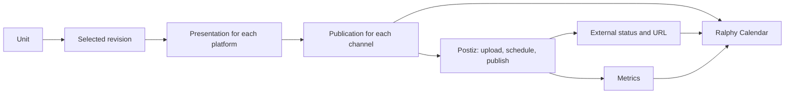

# Ralphy Desktop Content Calendar — UI Design Handoff

## Purpose

Design the existing workspace-level **Calendar** page in Ralphy Desktop.

The calendar must show the complete publishing lifecycle:

> A Unit is prepared → a revision is selected → publications are scheduled → each channel publishes or needs attention.

Calendar does not replace Units and must not become another content editor. It answers **when and where content will be published**. Units answer **what is being created**.

Documents and Media remain unchanged. Do not add a Compositions tab or another project-level calendar.

## Product model

The responsibilities are:

- **Unit** — the stable, user-facing content object.
- **Unit revision** — one concrete version of the video, media, and copy.
- **Presentation** — the selected revision adapted to one social platform.
- **Publication** — an attempt to publish a presentation to one connected account.
- **Calendar entry** — the scheduled date and time of a publication.
- **Postiz** — the delivery adapter for connected accounts, uploads, scheduling, external status, release URL, and analytics.

One Unit can create several publications. For example, a single selected revision can be scheduled to one TikTok account, two Instagram accounts, and one YouTube channel. The calendar should group these as one content event while preserving the status of every child publication.

## Revision safety

A scheduled publication is pinned to a specific Unit revision.

If the user later selects a newer revision in Units, the scheduled publication must not change silently. Show the relationship explicitly:

> Scheduled with revision 3
>
> Revision 5 is currently selected in Unit
>
> `Update scheduled publication…`

Updating a scheduled publication must be a deliberate action with a preflight check.

## Postiz API findings

The following findings are grounded in the Postiz Public API as reviewed on 2026-08-18.

### Connected accounts

`GET /integrations` returns connected accounts with their IDs, platform identifiers, names, pictures, profiles, and disabled state. Postiz calls these objects **channels** in its UI and **integrations** in the API. Ralphy should consistently call them **Channels** or **Accounts** and never expose the API term to users.

Source: [Postiz — List Integrations](https://docs.postiz.com/public-api/integrations/list)

### Calendar range

`GET /posts` accepts a UTC ISO `startDate` and `endDate`. It returns posts in that range with content, settings, publish date, release URL, and integration information. Ralphy can request only the visible calendar range and merge it with its local Unit and publication state.

Source: [Postiz — List Posts](https://docs.postiz.com/public-api/posts/list)

### Creating publications

`POST /posts` supports three top-level modes:

- `draft` — store content without a publish time;
- `schedule` — publish at an ISO 8601 date;
- `now` — publish immediately.

One request can contain several platform posts and returns a separate `postId` for each integration. The backend should batch a multi-channel Unit as one operation while Ralphy stores every returned external ID against its child publication.

Source: [Postiz — Create Post](https://docs.postiz.com/public-api/posts/create)

### Recommended slots

`GET /find-slot/{integrationId}` returns the next available posting slot for a connected account. This can power a `Use next available slot` action in the scheduling form.

Source: [Postiz — Find Available Slot](https://docs.postiz.com/public-api/integrations/find-slot)

### Media upload

Media is uploaded first through `POST /upload`. Postiz returns an `id` and public `path`, which are then included in the post payload. The endpoint accepts images and MP4; it does not accept PDFs.

Source: [Postiz — Upload File](https://docs.postiz.com/public-api/uploads/upload-file)

### Provider-specific settings

Each platform has its own settings schema, and `settings.__type` is required. Ralphy must not present one universal publishing form containing every possible field. Show platform-specific sections only for the selected channels.

Source: [Postiz — API Overview](https://docs.postiz.com/public-api/introduction)

### Analytics and notifications

Postiz exposes post analytics for 7, 30, or 90 days. Analytics belong in the inspector of a published event, not in the dense calendar card.

Source: [Postiz — Post Analytics](https://docs.postiz.com/public-api/analytics/post)

Postiz notifications may assist reconciliation, but Ralphy should keep its own structured publication state instead of treating notification prose as the source of truth.

Source: [Postiz — List Notifications](https://docs.postiz.com/public-api/notifications/list)

### Destructive behavior

Deleting a Postiz post by ID deletes all posts in the same group. The UI must never offer a silent or ambiguous `Delete post` action. Confirmation must enumerate all affected channels.

Source: [Postiz — Delete Post](https://docs.postiz.com/public-api/posts/delete)

### Rate limit

Postiz rate-limits the create-post endpoint per hour and recommends scheduling several posts in one request. The UI should represent a multi-platform schedule as one operation, and the backend should batch it.

Source: [Postiz — API Overview](https://docs.postiz.com/public-api/introduction)

## Information architecture

Keep the current workspace navigation:

- Projects
- Units
- Shared library
- Memory
- Calendar

Calendar belongs at workspace level because it combines Units from different projects and publications across the workspace's connected accounts.

When the user enters Calendar from a project, open the same workspace page with that project applied as a removable filter. Do not create a second project-specific calendar.

## Main Calendar screen

### Header and toolbar

Show:

- page title `Calendar`;
- `Today`;
- previous and next controls;
- current range, for example `August 2026`;
- `Month / Week / Agenda` view switcher;
- active timezone;
- filters;
- primary CTA `Schedule content`.

Recommended default: **Month** for editorial planning. **Week** is for exact times and slot conflicts. **Agenda** is for operational review of statuses and failures.

Available filters:

- Project
- Channel or account
- Platform
- Publication status
- Content readiness

Render active filters as removable chips and provide `Clear all`. Preserve filters, range, and scroll position when the user opens an event and returns.

### Ready-to-schedule drawer

Do not add another permanent left rail because Ralphy already has a workspace sidebar.

Use a collapsible `Ready to schedule` drawer opened from the toolbar. It contains Units in these states:

- Ready to schedule
- Needs review
- Rendering
- Render failed
- Postiz draft

Each row contains:

- vertical thumbnail;
- Unit title;
- project;
- selected revision;
- format and duration;
- supported platform icons;
- readiness label.

A Unit may be dragged to a date, but dropping must open the scheduling modal with the chosen date prefilled. A drop must never publish immediately.

## Calendar event card

One visual calendar event represents one Unit, even when it targets several accounts.

Show:

- time;
- small media thumbnail;
- short Unit title;
- platform icons;
- additional account count, such as `+2`;
- status icon and label;
- warning marker when one child publication needs attention.

Example:

> 18:30
>
> Product demo v4
>
> TikTok · Instagram · YouTube
>
> 2 scheduled · 1 needs attention

Platform color may be a subtle accent, but color must not be the only status signal. Always include an icon or text label.

For dense days, show the first events and a `+4 more` control that opens that day's Agenda view.

## Status model

Do not collapse content readiness and delivery into one status.

### Content readiness

- In progress
- Needs review
- Ready to schedule
- Rendering
- Render failed

### Publication status

- Draft
- Scheduled
- Uploading
- Submitting
- Published
- Partially published
- Failed
- Account disconnected
- Canceled

`Partially published` is essential. A Unit may publish successfully to Instagram but fail on TikTok or YouTube.

## Event inspector

Clicking an event opens a right-side inspector while keeping the calendar visible. Do not use a modal for basic inspection.

### Header

Show:

- thumbnail or video preview;
- Unit title;
- project;
- `Open Unit`;
- pinned revision, for example `Revision 4`;
- scheduled date, time, and timezone.

### Channel rows

For every child publication show:

- account avatar;
- platform and account name;
- publication status;
- scheduled or published time;
- release URL after publication;
- error and recovery action when needed.

Example:

- TikTok · `@ralphy` — Published
- Instagram · `@ralphy.ai` — Scheduled
- YouTube · `Ralphy` — Failed · Thumbnail missing

### Actions

- Edit schedule
- Publish now
- Move to draft
- Retry failed channels
- Open Unit
- Open published post
- Remove from calendar

Destructive confirmation must list all affected accounts and explain that Postiz groups may be removed together.

For a published event, add compact metrics:

- Views
- Likes
- Comments
- Shares
- Last synced

## Scheduling modal

Use a large modal with progressive disclosure. It contains five sections:

1. Content
2. Channels
3. Schedule
4. Platform settings
5. Preflight

### Content

Show:

- Unit preview;
- revision selector;
- render state;
- caption;
- platform presentation previews.

An unrendered revision cannot be scheduled. Explain the reason next to the disabled action and provide `Render revision`.

### Channels

List connected Postiz accounts with:

- avatar;
- account name;
- platform;
- connection state;
- checkbox.

A disconnected account cannot be selected. Show `Reconnect` with the failure reason where available.

### Schedule

Modes:

- Schedule
- Publish now
- Save as draft

For Schedule, show:

- date;
- time;
- timezone;
- `Use next available slot`;
- conflict warning when content is already scheduled nearby.

Display dates in the selected local timezone and send normalized UTC ISO timestamps to the backend.

### Platform settings

Use tabs or accordions only for the platforms selected in Channels.

#### TikTok

- Privacy
- Allow comments
- Allow duet
- Allow stitch
- Auto-add music
- AI-generated content disclosure
- Branded content
- Direct post / Upload to TikTok inbox

Most TikTok controls apply only to `DIRECT_POST`. Explain this dependency in context instead of leaving disabled controls unexplained.

Source: [Postiz — TikTok Settings](https://docs.postiz.com/public-api/providers/tiktok)

#### Instagram

- Feed post / Story
- Trial reel
- Collaborators
- Audio
- Carousel order

Some capabilities depend on the account connection type. Disabled settings must state why they are unavailable.

Source: [Postiz — Instagram Settings](https://docs.postiz.com/public-api/providers/instagram)

#### YouTube

- Title
- Visibility
- Made for kids
- Thumbnail
- Tags

Source: [Postiz — YouTube Settings](https://docs.postiz.com/public-api/providers/youtube)

Future providers should add their own section rather than expanding one giant universal form.

### Preflight

Validate before the primary action:

- media format is valid for every platform;
- upload completed;
- caption is present where required;
- provider-required fields are complete;
- every selected account is connected;
- the revision is rendered and stable;
- schedule conflicts are acknowledged.

The primary CTA reflects the actual operation:

- `Schedule to 3 channels`
- `Publish now to 2 channels`
- `Save 4 drafts`

During upload or submission, disable the CTA and show per-file or per-channel progress. On partial failure, preserve successful results and offer retry only for failed channels.

## Drag and drop

Allow:

- Ready Unit → calendar date
- Scheduled event → another date
- Scheduled event → unscheduled drawer

Dropping a multi-channel event must ask:

> Move all 3 publications?
>
> TikTok, Instagram, and YouTube will move to Aug 22 at 18:30.

The public Postiz documentation does not expose a clearly documented, atomic “change scheduled date” endpoint. Do not design the interaction as guaranteed instant rescheduling. Ralphy may update its local CalendarEntry while the adapter updates, cancels, or recreates external posts.

Published events cannot be dragged.

Provide a keyboard-accessible `Move…` action. Drag and drop must never be the only way to reschedule.

## Empty, loading, and error states

Design all of the following:

- Normal calendar
- Dense calendar day
- Empty calendar with Ready Units
- Completely empty workspace
- Postiz not connected
- Loading skeleton
- Sync error with Retry
- Offline or stale data
- Rate limited
- Disconnected account
- Upload failed
- Partial publication failure
- Externally deleted publication

Postiz-disconnected copy:

> Connect Postiz to schedule and publish content.
>
> Your Units remain in Ralphy. Postiz handles delivery to connected channels.

CTA: `Connect Postiz`.

Credentials, API keys, and custom server URL belong in **Settings → Publishing**, not inside Calendar.

## Accessibility and interaction quality

- Full keyboard navigation through toolbar, calendar cells, events, drawers, and modal fields.
- Visible focus rings.
- Text or icon in addition to status color.
- Accessible names for platform logos and icon-only controls.
- Logical focus movement when a drawer, inspector, or modal opens and closes.
- Escape closes the active overlay and returns focus to its trigger.
- A keyboard alternative for every drag action.
- Minimum comfortable hit area for dense icon buttons.
- Loading and error feedback announced without stealing focus.
- Motion should communicate spatial continuity, stay around 150–300 ms, and respect reduced-motion preferences.
- Light and dark themes must use existing Ralphy semantic tokens and meet text contrast requirements.

## Required design frames

1. Calendar / Month / Default
2. Calendar / Week / Dense schedule
3. Calendar / Agenda / Failed publications
4. Ready-to-schedule drawer
5. Schedule content modal
6. Platform settings / TikTok
7. Platform settings / Instagram and YouTube
8. Event inspector / Scheduled
9. Event inspector / Partially published
10. Empty / Postiz disconnected
11. Drag-and-drop confirmation
12. Delete-group confirmation

Primary desktop frame: `1440 × 900`.

Density check: `1280 × 800`.

Also show the page with the workspace sidebar collapsed.

## Visual direction

- Reuse the existing Ralphy Desktop design system, typography, spacing, radius, surfaces, and sidebar.
- Do not introduce a new palette or unrelated editorial aesthetic.
- Use the existing Lucide icon language and consistent stroke weight.
- Prefer a content-first, restrained interface over decorative dashboard cards.
- Keep only one primary action per surface.
- Use platform brand color as a small identifying accent, not as the page palette.

## Non-goals

Do not design:

- a new Compositions tab;
- separate calendars inside every project;
- a full caption or video editor inside Calendar;
- independent calendar cards that make every platform look like separate content;
- automatic revision replacement after scheduling;
- unconditional instant rescheduling;
- large analytics charts inside the calendar grid;
- credentials or Postiz server setup inside Calendar;
- a new visual system unrelated to Ralphy Desktop.

## Product principle

> Units answer “what are we creating?”
>
> Calendar answers “when and where will it go live?”
>
> Postiz remains the publishing engine beneath the Ralphy interface.
