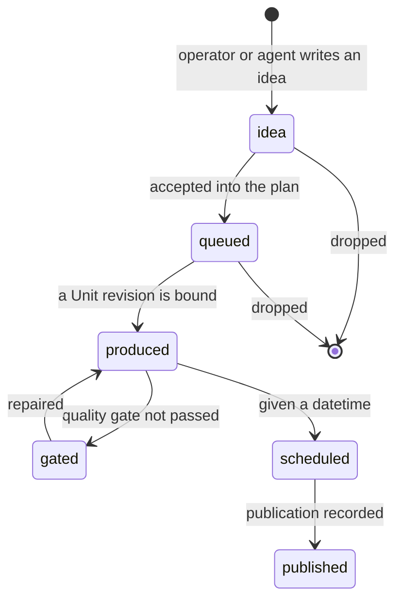

# Content plan versus Calendar — design note

## The observed problem

Two panels answer the same question from different sources, and they disagree.

The workspace overview's **Content plan** is built entirely from Units and publications that already
exist: a cadence coverage bar, a fourteen-day strip of upcoming *publications*, and a "Ready, not
scheduled" list of finished Units. The **Calendar** is built from publications too, through its own
reader. On the real library the plan's day strip shows nothing while the Calendar shows eight
publications between 25 and 28 August — the same rows, read twice, reconciled nowhere.

So the panels do not divide the work. They duplicate it, and one of them is wrong at any moment.

## The operator's distinction

> The Calendar reflects finished content that is written into the calendar. The content plan is
> essentially just ideas, mostly not yet realised — though some may be realised and link to a Unit.

That is a different axis from the one either panel currently draws. Both panels sort by
*publication state*. The operator sorts by **whether the thing has a place in time yet**.

Those two axes are not the same, and the difference is where the confusion lives:

| | No datetime | Has a datetime |
|---|---|---|
| **No Unit yet** | An idea. Belongs to the plan. | A commitment with nothing made — a booked slot with a hole in it. Belongs to **both**. |
| **Unit exists** | Ready, not scheduled. Belongs to the plan. | Scheduled or published. Belongs to the Calendar. |

The bottom-left cell is what "Ready, not scheduled" already covers, and it is the one part of
today's Content plan that is right. The top-right cell — a date the operator committed to with no
content behind it — is the most useful row in the whole system and neither panel can draw it.

## Core already models this

This does not need a new entity. The domain store has carried the whole lifecycle since schema 9,
and nothing uses it.

`calendar_entries` has:

- `kind IN ('slot', 'entry')` — a **slot** is a recurring cadence template (weekday, local time,
  timezone, no datetime); an **entry** is one concrete thing (a datetime, no weekday).
- `state IN ('idea', 'queued', 'produced', 'gated', 'scheduled', 'published')`.
- `scheduled_at`, nullable.
- `unit_revision_id`, `presentation_id`, `social_account_id`, `publication_id` — each nullable, each
  filled as the entry acquires the thing it names.
- `campaign_id` and `campaign_cell_id` — the planning layer above it.

And `campaign_cells` carries the topic matrix: `thesis_id`, `format`, `angle`, `keyword`, `channel`,
`priority`, and `state IN ('planned', 'produced', 'published')`, with `unit_revision_id` bound when
a cell is realised.

**What is actually used today:** the word `idea` appears in exactly one place in Core's calendar
code — as the state written for a *slot*. The `idea | queued | produced | gated` half of the entry
lifecycle is never written and never read. The desktop's `calendar.create` requires a
`unitRevisionId`, so an idea cannot be created from the app at all; every calendar row necessarily
already has a Unit behind it. That is precisely why the Content plan has nothing to show that the
Calendar does not.

## The lifecycle, as the schema already allows

Two properties matter for the design:

1. **Identity survives.** An idea that becomes a Unit and then a publication is the *same row*
   throughout — `unit_revision_id`, then `presentation_id`, then `publication_id` are filled in on
   it. So a card does not get recreated as it progresses; it moves between views. That is what makes
   "an idea that may later link to a Unit" a first-class thing rather than a note the operator has
   to reconcile by hand.
2. **A datetime is independent of a Unit.** `scheduled_at` and `unit_revision_id` are separate
   nullable columns. An entry can have a date and no Unit, or a Unit and no date. The schema already
   admits all four cells of the table above.

## The split

**One rule decides which panel a row appears in: does it have a `scheduled_at`?**

### Content plan — the pipeline

Everything without a datetime, plus the capacity it is measured against.

- **Cadence** (from `kind = 'slot'`): what this workspace has committed to producing — weekday,
  local time, channel. This is the denominator the coverage bar has always wanted, and it is real
  data rather than the "cadence targets unavailable from the current Core contract" the panel shows
  today.
- **Ideas** (`state = 'idea'`, no `scheduled_at`): a title, an intended format and channel, and
  nothing else required. The cheapest possible row to create — this is where a chat turn's "we should
  do a thing about X" lands.
- **Queued** (`state = 'queued'`): accepted, waiting for production.
- **In production** (`state IN ('produced', 'gated')`, no datetime): a Unit exists. A `gated` row
  carries why it did not pass, and links to the repair route.
- **Ready, not scheduled**: keep exactly as it is. It is the pipeline's last stage and the only part
  of today's panel that already answers the right question.
- **Campaign cells not yet bound**: the topic matrix's unfilled cells, which are ideas with more
  structure. Shown as a group per campaign, not mixed into loose ideas.

The panel's headline number is the honest one: *how much of the committed cadence has something
behind it*. That is coverage the operator can act on, unlike a count of publications.

### Calendar — the timetable

Everything with a datetime, whatever state it is in.

- `scheduled` and `published` as today.
- **`gated` with a datetime** — a date is coming and the content failed its gate. Today this is
  invisible until it fails.
- **A datetime with no Unit** — the committed-but-empty slot. This is the row that earns the
  Calendar its place: it is a deadline, and nothing else in the app can state one.

The Calendar keeps its month, week and agenda views and its existing publication vocabulary. What
changes is that it stops being the only place a plan can be seen, and starts being able to show a
commitment that has nothing behind it yet.

### Where they touch

- A card is in exactly one panel at a time, decided by `scheduled_at`. Scheduling moves it; removing
  the date moves it back. No row is drawn twice.
- Both panels read `calendar_entries`, so they can no longer disagree. Today's disagreement is the
  direct result of two readers over two different tables.
- The plan links forward ("Schedule…") and the Calendar links back ("Return to plan"), and both
  link sideways to the Unit when one exists.

## What this needs from Core

Each of these is a contract gap, not a missing feature of the UI.

| Need | Today | Required |
|---|---|---|
| Create an idea | `calendar.create` requires `unitRevisionId` | Allow an entry with neither a Unit nor a datetime |
| Bind a Unit to an existing entry | No verb | Set `unit_revision_id` on an entry, preserving its identity |
| Move an entry between states | `calendar.submit` / `reschedule` only | A state transition that respects the lifecycle above |
| Read the pipeline | `calendar.overview` takes `from`/`to` — a time window | A read for entries *without* a datetime, which no window can select |
| Read the cadence | Slots are never returned | Expose `kind = 'slot'` rows so coverage has a real denominator |
| Campaign cells | `campaign.list` / `show` exist; nothing reads them in the desktop | A workspace-scoped read of unbound cells |
| Workspace timezone | Panel states it is unavailable and uses the device's | Slots already store a `timezone`; expose it |

The last row is worth calling out: the Content plan currently prints a disclaimer that the workspace
timezone is not available, while `calendar_entries` stores a timezone on every slot. The data is
there; only the read is missing.

## Decisions this asks for

1. **Is `scheduled_at` the dividing line?** Recommended: yes. It is a single, checkable property,
   it matches the operator's own words, and it puts the committed-but-empty deadline in the Calendar
   where a deadline belongs.
2. **Should an idea be creatable from the chat?** Recommended: yes, and it is the strongest argument
   for the whole change — "add that to the plan" is a sentence an operator says, and today it has
   nowhere to land. An idea with a title and a channel is a two-column row.
3. **Do campaign cells appear in the plan, or only in a campaign view?** Recommended: in the plan,
   grouped by campaign, because an unbound cell *is* an idea with more structure and hiding it makes
   the coverage number wrong.
4. **What happens to a dropped idea?** Recommended: archive rather than delete, consistent with how
   memory and Units already treat retirement — a dropped idea is evidence about the workspace.
5. **Does the Content plan keep its fourteen-day framing?** Recommended: no. A pipeline has no window;
   the window is what forced it to read publications in the first place. Cadence coverage carries the
   time dimension instead.

## Out of scope

- Reworking the Calendar's month, week and agenda layouts. Only its data source and its state
  vocabulary change.
- Campaign planning itself — creating a topic matrix, scoring it, ROI. That is the campaign surface,
  which this note only consumes.
- Anything that draws a state Core cannot yet write. Until the transitions exist, an idea row is
  read-only after creation.
