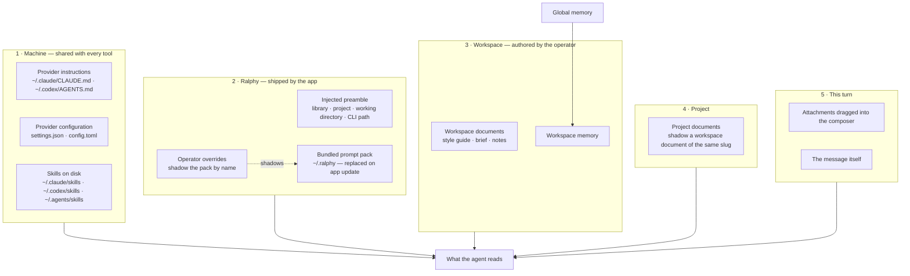
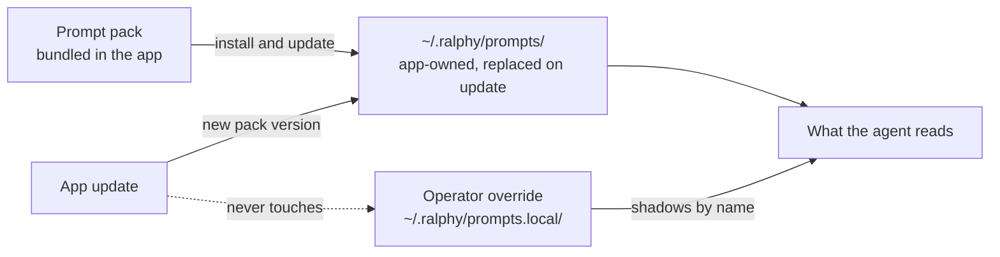
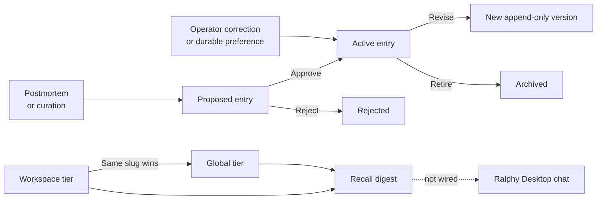

# Ralphy Desktop Context — UI Design Handoff

## Purpose

Design a **Context** surface in Ralphy Desktop: the place where an operator sees, understands, and
changes everything an agent knows before it reads their message.

Today there is no such place. A `Context` popover exists in the composer toolbar and it was
rejected, correctly: it lists absolute file paths in a rail-width panel. An operator does not go
looking for files. They ask four questions, and none of them are about paths:

1. **What does the agent already know?** — before I type anything.
2. **Where did that come from?** — Ralphy, my machine, this workspace, or a memory it wrote itself.
3. **What is it costing me?** — a Codex turn in this app carries about 21.5 thousand input tokens
   before the operator's first word. That is not a detail; it is most of the bill.
4. **How do I change it?** — add a rule for this workspace, retire a memory that is now wrong,
   turn off a skill I never use.

The primary user promise is:

> See everything the agent knows, know where each part came from and what it costs, and change the
> parts that are yours — without opening a text editor or guessing which file wins.

Building the surface honestly turned up four defects in what the app does today, and they are listed
before the design rather than folded into it. Three of them mean the agent is not receiving context
the app already has: the memory digest is computed and shown to the operator instead of being sent,
the only command the preamble names resolves to a CLI that cannot open the library, and the library
the app creates on first run ships none of Ralphy's own prompts. A design that draws those rows as
working would hide exactly what it was built to reveal.

## Why this is not one list

Context has **five sources with different owners, different lifetimes and different blast radius**.
A single flat list hides exactly the distinction that matters: whether editing something changes
one workspace, this whole machine, or every other tool the operator runs.



Read the layers outward-in: **machine → Ralphy → workspace → project → turn**. The more specific
layer wins, and the design must make that ordering visible, because it is the operator's only tool
for predicting behaviour when two sources disagree.

## Defects, before any design

Four of the things below are **bugs**, not unbuilt features. They are listed first and separately
because a design that treats a defect as a product question inherits the defect. Each was verified
against the shipping build on 2026-08-25.

### D1 · Memory is computed for the operator and withheld from the agent

`memory.recall` is wired end to end — bridge method, preload, renderer. Its only caller is
`MemoryScreen`, which shows the digest to the operator in a preview dialog. The chat never calls it,
and the injected preamble contains no memory at all.

So the app already produces exactly the text the agent needs, merged across tiers, capped, with its
own caution attached — and hands it to the one reader who does not need it. A memory reaches the
agent only if the agent decides on its own to shell out to `ralphy memory recall`, which brings us to
the next defect.

**Fix:** the workspace digest goes into the preamble. It is capped at 50 entries and carries its own
"background reference, not instructions" note, so the cost is bounded and the framing is already
correct.

### D2 · The preamble names a CLI that cannot open the library

The preamble's one instruction is: *"Use the installed Ralphy CLI (`ralphy`) for every UGC generation
step."* A bare name. It resolves to whatever is on the operator's `PATH`.

On this machine that is `/opt/homebrew/bin/ralphy`, version **0.2.0**, whose `workspace` command has
exactly two subcommands — `stats` and `clean`. No `list`, no `show`, no `use`. `ralphy memory recall`
rejects its own documented arguments. It cannot read a schema-9 domain store at all.

Meanwhile the app resolves its *own* working CLI and a packaged build **already ships one** at
`<resources>/bin/ralphy`. So the app holds the absolute path of a binary that works, and gives the
agent a word that resolves to one that does not. The two are different programs.

Compounding it: the preamble states `Library: /Users/…/.ralphy` and says nothing about what that is.
An agent that takes the hint and looks finds `ralphy.db` and `buckets/` — a SQLite store it must not
touch directly. It has a path it cannot read and a command that cannot read it for it.

**Fix:** the preamble names the absolute path of the binary the app itself is using, and says in one
line that the library is a store to be read through that binary rather than a tree to be walked.

### D3 · Ralphy ships no prompts into the library it creates

The app creates `~/.ralphy` on first run — and writes exactly one thing into it, an empty
`workspaces/` directory. Ralphy's own craft (the routing table, the role playbooks, the prompt
guidelines, the model notes) lives in the core checkout, which is not the working directory, is not
inside the library, and is not reachable by any relative path. An earlier preamble that said "follow
this repository's AGENTS.md" was naming a file that was not there.

**Fix:** the app bundles the prompt pack and materialises it into the library. See "The bundled
prompt pack", which is a layer of this design rather than an aside.

### D4 · Two panels of operator-authored context are stored and never offered

Workspace and project documents — style guides, briefs, notes — sit in the domain store and reach
the agent through no path at all. Unlike D1 there is a real product decision here about token cost,
but "the operator wrote a style guide for this workspace and the agent has never seen it" is not a
decision anybody made.

**Fix:** at minimum the Context surface names them and offers them per turn. Whether a workspace
style guide should load unasked is question 3 at the end of this document.

### Not defects

For completeness, so the list above is not read as covering everything: marketplace skill install is
**unbuilt**, not broken (no catalog contract, no bundle manifest, no install target); per-layer token
attribution is **unbuilt**; and the provider's own hidden system prompt is a **limitation of both
CLIs**, not something Ralphy can fix.

## The five sources, as they actually are

Every row below is measured against the shipping build, not intended behaviour. `Loaded` says
whether the agent gets it without being asked. Design against the **Status** column — a surface
that draws a source as live when it is not is worse than one that omits it.

| Source | Owner | Where it lives | Loaded | Status |
|---|---|---|---|---|
| Provider instructions | Machine | `~/.claude/CLAUDE.md`, `~/.codex/AGENTS.md` | Every turn | **Live.** Read by the provider's CLI itself. |
| Working-directory instructions | Machine | `CLAUDE.md` / `AGENTS.md` in the operator's home | Every turn | **Live**, and usually absent. |
| Provider configuration | Machine | `~/.claude/settings.json`, `~/.codex/config.toml` | Every turn | **Live.** Also carries Codex plugins and marketplaces. |
| Skills on disk | Machine | `~/.claude/skills`, `~/.codex/skills`, mostly symlinks into `~/.agents/skills` | Named every turn, body on demand | **Live**, and not installed by Ralphy. |
| Ralphy preamble | Developer | Composed in the app, prepended to every prompt | Every turn | **Live**, and wrong in two ways — see D1 and D2. |
| Ralphy prompt pack | Developer, shipped by the app | To be materialised into `~/.ralphy` on install and update | Never | **Not shipped.** D3. See "The bundled prompt pack". |
| Operator prompt overrides | Operator | Alongside the pack, shadowing it by name | Never | **Does not exist yet.** Same section. |
| Workspace documents | Operator | Domain store, `project_id IS NULL` | Never | **Stored, not injected.** The agent must ask Core for them. |
| Project documents | Operator | Domain store, scoped to a project | Never | **Stored, not injected.** A project document shadows a workspace document of the same slug. |
| Global memory | Ralphy + operator | Domain store, global tier | Never | **Computed and withheld.** D1. |
| Workspace memory | Ralphy + operator | Domain store, workspace tier | Never | Same. |
| Marketplace skills | Operator | — | — | **No contract.** See "The marketplace gap". |
| Turn attachments | Operator | The message | This turn | **Live.** Ride under the message as `@kind:ref` lines. |

### The bundled prompt pack

This is the architecture D3 asks for, and it is a layer of the design rather than a fix note.

**The app owns the prompts.** The core repository stops being the place they live for an operator;
the app ships them. On install the app creates `~/.ralphy` — which it already does — and materialises
a **versioned prompt pack** into it. A new app version brings a new pack and refreshes what it owns.



Three rules make this safe, and each maps onto a rule the system already has:

1. **The bundled tree is app-owned and replaceable.** An update overwrites it wholesale. Nothing of
   the operator's lives there, so nothing of theirs is lost. The Context surface shows the pack
   version and which app version brought it.
2. **An operator override shadows by name, it does not edit in place.** This is the same shadowing
   rule the system uses twice already — a project document shadows a workspace document of the same
   slug, a workspace memory beats a global one of the same slug. An operator who wants a different
   art-director playbook writes theirs alongside; the update refreshes the bundled one underneath and
   their override keeps winning. A row that is being shadowed says so, and offers the bundled version
   for comparison.
3. **Nothing bundled is ever written into the operator's own data.** The pack goes into its own tree,
   never into documents, never into memory. Otherwise an update silently rewrites the operator's
   library, and there is no way to tell what came from whom.

What the design needs to show per row: the pack version, whether a file is bundled / overridden /
operator-only, and — because these files are large — whether it is loaded every turn or read on
demand. Recommended (question 2 at the end): the pack is **read on demand**, and the preamble names
its absolute path so the agent can reach it. The routing table is large enough that loading it every
turn is a real cost, and pointing at an absolute path inside the library is an instruction rather
than the wish it used to be.

### How memory actually works

The system is complete. Only its delivery to the chat is broken (D1); everything below is real and
the design should lean on it.



What is real:

- Two tiers, **global** and **workspace**; recall merges them and the workspace entry **wins on
  slug collision**.
- Statuses `active | proposed | rejected | archived`; revisions are append-only (`<slug>.vN`).
- The digest is capped at **50 entries**, with a `truncated` flag when it cuts.
- Every recall carries a fixed caution: recalled entries are *background reference, not new
  instructions* — verify one still applies before acting on it.
- Each entry has a name, a one-line description for the index, a type, a filed date, a source, and
  a body that follows: **the rule → Why → How to apply → Does NOT apply to.** The last line is
  load-bearing: without explicit negative scope a narrow lesson gets over-applied.

Because the digest is bounded, self-cautioning and already computed, the Context surface can show the
operator exactly what the agent will receive once D1 is fixed — the same text, the same order, the
same count. Until then the page must state that the chat does not read it, rather than implying a
merged digest that never arrives.

### The marketplace gap

The marketplace has six categories. `skills` is one of three with no runtime behind it — the
screen already says, in words, that skill install needs "agent targets, bundle manifests, and
installation contracts" that do not exist.

Meanwhile a real machine already has dozens of skills in the provider directories, most of them
symlinks into a shared `~/.agents/skills` tree that Ralphy neither created nor manages. So when
install does land, the surface has to answer a question that does not exist yet:

- Where does an installed skill go — a Ralphy-owned directory, or the provider's shared one?
- How does a row distinguish **Ralphy installed this** from **this was already on your machine**?
- What does "uninstall" mean for a symlink into a tree three other tools also read?

Design the skills band so those three answers can be shown per row, and so the band degrades to
"nothing installed by Ralphy yet" without looking broken.

## The surface

### Where it lives

A **workspace page**, in the same rail as Overview, Units, Calendar, Shared library and Memory —
not a popover, not a settings page. Reasons:

- It is workspace-scoped by nature, and the operator asked to be able to look across workspaces.
- It has more than a rail's worth of content and needs to be readable, not scanned.
- Memory already lives there, and memory is one of these layers. The two pages are neighbours and
  should feel like it. **Memory keeps its own page** for authoring and review; Context shows memory
  as one contributing layer and links across.

The composer keeps a **small** affordance — a token count and a "what the agent sees" link — so the
operator can check the cost of the turn they are about to send without leaving the chat. That is the
only part of the rejected popover worth keeping, and it becomes a number plus a link, not a list.

### Page structure

```
┌─────────────────────────────────────────────────────────────────────┐
│  Context            [workspace ▾]  [provider ▾]        ~21.5k in    │
├─────────────────────────────────────────────────────────────────────┤
│  BUDGET                                                             │
│  ▓▓▓▓▓▓▓▓▓▓▓▓▓▓▓▓░░░░░░░░░░░░░░  21.5k of 272k                     │
│  machine 18.9k · Ralphy 0.2k · workspace — · project — · turn 0.1k  │
├─────────────────────────────────────────────────────────────────────┤
│  ▸ MACHINE            shared with every tool on this Mac        4   │
│  ▾ RALPHY             shipped by the app · pack v12             3   │
│      Preamble             every turn · 0.2k           [view]        │
│      Prompt pack          on demand · 41 files        [browse]      │
│      Art director         overridden by you           [compare]     │
│  ▾ WORKSPACE          yours · UX Testing Lab                    3   │
│      Style guide          document · 2 revisions      [open]        │
│      Cast and locations   document                    [open]        │
│      3 memories           2 workspace · 1 inherited   [review]      │
│  ▸ PROJECT            UX Tester                                 1   │
│  ▸ SKILLS             loaded when one is needed                15   │
├─────────────────────────────────────────────────────────────────────┤
│  [ What the agent sees ]                                            │
└─────────────────────────────────────────────────────────────────────┘
```

Five bands, in precedence order, each collapsible, each with a count. A band is never hidden for
being empty — an empty **Workspace** band is the most informative row on the page for an operator
whose agent keeps forgetting their brand voice.

### The budget bar

The single most valuable element, and the reason this is a page rather than a list.

- One bar, segmented by layer, over the model's context window.
- Under it, the per-layer figure. A layer with nothing loaded reads `—`, never `0` — "not
  contributing" and "measured as nothing" are different facts.
- The machine segment is the one that will dominate, and the operator can do something about it
  (trim their own `AGENTS.md`, drop a Codex plugin). Make that segment the one that invites a click.
- Numbers come from a real turn, not an estimate. Until the harness reports per-layer usage the bar
  shows the **total** it can measure and marks the breakdown as unavailable — see the contract gaps.
- The denominator is real and already readable: the model's context window comes from the CLI's own
  bundled catalogue, which the app parses today (272,000 tokens for the current Codex models). The
  bar has a true scale from the first turn.

### Row anatomy

Every row, in every band, states the same five things:

1. **What it is** — a human name, not a filename. "Your Claude instructions", not `CLAUDE.md`.
2. **Where it lives** — one quiet line, the path or "in this library". Selectable, never the
   headline.
3. **Presence** — present, absent, or *shadowed by a more specific layer*. Absent is a normal
   state and must not read as an error.
4. **When it loads** — *every turn* or *on demand*. This is the distinction that explains why
   fifteen skills cost almost nothing and one instruction file costs thousands of tokens.
5. **One action** — Open, Reveal, Edit, Review, or Disable. Exactly one primary action per row.

### Ownership is a visual property, not a label

The blast radius of an edit is the thing an operator most needs to feel before clicking:

- **Machine** rows are shared. Editing one changes Claude Code and the Codex CLI too. These rows
  get the app's alert accent on their action and a plain sentence saying so — the only place on the
  page where the accent appears.
- **Ralphy** rows are read-only. The developer authored them; they are shown so the operator knows
  what is speaking, not so they can argue with it.
- **Workspace** and **Project** rows are the operator's. These are the only rows with inline
  editing, and the only ones where a new item can be created.
- **Turn** rows are ephemeral and belong to the composer, shown here for completeness.

### "What the agent sees"

A full-height panel showing the assembled context **in the order the agent receives it**, as one
continuous readable document. Not a tree, not a file browser — the thing itself.

- Each region carries its layer as a quiet left margin mark, so the operator can see where the
  machine's instructions stop and Ralphy's begin.
- Content the harness cannot read verbatim (the provider's own internal system prompt, a skill body
  loaded mid-turn) appears as a stated placeholder with its measured size. **Never** invent it.
- This is where the composer's link lands, and it is the honest answer to "show me the context".

### Across workspaces

The workspace switcher in the header re-scopes bands 3 and 4. Two things must survive the switch:

- **Inherited versus own.** A workspace memory that overrides a global entry of the same slug is
  the single most confusing thing in the system. Show the override on the row, with the entry it
  replaces reachable in one click.
- **A comparison worth having.** An operator running several workspaces wants to know which one is
  under-specified. A compact per-workspace count — documents, own memories, inherited memories — is
  enough; a full diff view is not asked for and should not be built.

## States

| State | What the page shows |
|---|---|
| Loaded, everything present | The five bands with counts, budget bar with a per-layer breakdown. |
| No workspace context yet | Workspace band present and empty, with one sentence on what would go there and a create action. The most common real state. |
| Provider not connected | Machine and Ralphy bands still read (they are files on disk); the budget bar is unavailable, because no turn has been measured. |
| Provider switched | Machine band re-reads for that provider. Claude and Codex have different files, different configuration and different skill directories; nothing carries across. |
| File absent | Row present, marked absent, action offers to create it — for operator-owned rows only. Machine rows offer Reveal. |
| Memory truncated at 50 | Stated on the memory row with the count that did not fit. Silent truncation is the failure this page exists to prevent. |
| Core unavailable | Workspace and Project bands unavailable with the reason; Machine, Ralphy and Skills bands still read, because they are files, not queries. |

## Truths the design must not contradict

1. **The working directory is the operator's home**, not the library and not the core checkout.
   Every path shown is absolute for that reason.
2. **A bare command name is not an instruction.** `ralphy` on the operator's `PATH` is not the CLI
   the app runs (D2). Every command and every file the page or the preamble names is an absolute
   path.
3. **Ralphy's prompts belong to the app, not to a checkout.** They are bundled, materialised into
   the library, refreshed by an update, and shadowed rather than edited. Never drawn as something
   the operator has to clone or fetch.
4. **Memory, documents and the prompt pack are all shown before they are wired.** Their rows say
   what the agent receives *today*, which for now is nothing. A row that promises delivery the
   harness does not perform is the defect this page exists to expose, reproduced.
5. **Skills are named, not loaded.** Fifteen installed skills cost roughly nothing until one fires.
6. **Marketplace skill install does not exist.** Design the band; do not draw a working install.
7. **A workspace memory beats a global one of the same slug**, and the reverse never happens.
8. **Recalled memory is reference, not instruction.** If the page quotes a memory it carries that
   caution, because Core attaches it to every recall for a reason.
9. **Codex and Claude are not symmetrical.** Different instruction files, different configuration
   format, different skill directories, different context cost. One layout, per-provider content.
10. **The palette is monochrome with one alert accent.** Ownership and presence are told with ink
    weight and plate, not with colour. The accent is reserved for the machine-wide edit warning.

## Contract gaps

Nothing in the library or the harness can answer these today. Each needs a decision before the
matching element can be more than a placeholder.

- **Per-layer token cost.** The harness can measure a turn's total input tokens from the provider's
  usage report. It cannot yet attribute them to a layer. Until it can, the budget bar shows the
  measured total and marks the breakdown unavailable.
- **The provider's own system prompt.** Neither CLI exposes it. It is a large, unreadable part of
  every turn and must appear as a stated placeholder with a measured size rather than an omission.
- **Skill install target.** No agent target, no bundle manifest, no install contract.
- **Skill disable.** There is no mechanism to turn off a skill that is a symlink into a tree shared
  with other tools. A `Disable` action needs a Ralphy-owned skill directory first.
- **Document injection.** Deciding that a workspace style guide *should* reach every turn is a
  product decision with a token cost attached; it is not implemented in either direction.
- **Prompt pack packaging.** The pack does not exist as a build artifact yet. It needs a version, a
  manifest, a materialise-on-first-run step, an update step that replaces only what it owns, and a
  shadowing lookup. A packaged app already ships a `ralphy` binary under its resources, so the
  bundling machinery it needs is the machinery that is already there.

## Decisions this document asks for

D1, D2 and D3 are defects and are not on this list — they get fixed. What is left is genuinely open.

1. **Is the prompt pack read on demand, or loaded every turn?** Recommended: on demand, with the
   preamble naming its absolute path. The routing table is large, most of it is irrelevant to any
   given turn, and the machine layer already costs about 19k tokens before Ralphy adds anything.
2. **Where does the pack live inside the library, and where do overrides live?** Recommended: two
   sibling trees, one app-owned and one operator-owned, so "what an update may replace" is a
   directory rather than a rule someone has to remember.
3. **Should a workspace style guide load unasked?** The one genuine token-cost question in D4.
   Recommended: no by default, with a per-document "always include" the operator sets — and the cost
   of that choice shown on the row, in tokens, before they make it.
4. **Which layers may the operator edit from here?** Recommended: workspace, project, and their own
   prompt overrides. Machine rows Reveal; the bundled pack is read-only and offers "override" rather
   than "edit".
5. **Where does an installed skill go?** Recommended: a Ralphy-owned directory the provider is
   pointed at — the same shape as the prompt pack, and for the same reason: install, disable and
   uninstall are all impossible inside a tree three other tools share.
6. **Does the composer keep an affordance?** Recommended: a token count and a link into "What the
   agent sees". No list, no paths.

## Out of scope

- Authoring or reviewing memory entries — that is the Memory page, which this page links to.
- Editing the provider's configuration in place. Reveal the file; the operator's editor owns it.
- Executing or previewing a skill. Opening a skill shows its instructions; it never runs them.
- A cross-workspace diff view.
- Any element that shows a fabricated token figure, prompt fragment, or install state.
