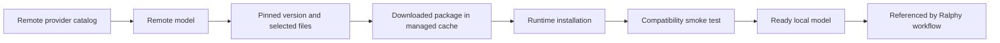

# Ralphy Desktop Local Models — UI Design Handoff

## Purpose

Design a global **Local Models** surface for discovering open generative models, downloading their files, installing them into a compatible local runtime, and selecting them in Ralphy workflows.

The product promise is:

> Find a model, understand whether it can run on this computer, install it safely, and use it without leaving Ralphy.

This is not a generic model marketplace or a hosted inference catalog. It manages model files and runtimes on the user's machine.

## Placement in the application

Local Models belongs at **application level**, not inside one workspace.

Downloaded weights, runtime registrations, credentials, disk usage, and hardware compatibility are machine-wide resources. Every workspace may reference the same local installation. Putting installation inside each workspace would create duplicate state and imply that the same multi-gigabyte model must be downloaded repeatedly.

Recommended placement:

- add `Local Models` to the global application navigation or global Library area;
- allow workspace and project generation forms to open the same model picker;
- show which workspaces use an installed model, but do not make a workspace own the installation.

Keep the existing workspace navigation unchanged.

## Product model

The interface must keep these concepts separate:

- **Discover** — search remote provider metadata.
- **Download** — fetch a pinned set of files into a managed local cache.
- **Install** — validate the package and register it with a compatible runtime.
- **Ready** — the runtime has passed a minimal load or capability check.
- **Use** — select the ready model in a Ralphy generation workflow.

Do not label a completed download as `Installed` unless runtime registration has also succeeded.

## Provider research

The following findings were reviewed against official sources on 2026-08-18.

### Hugging Face Hub — primary catalog and file source

Hugging Face should be the first catalog integration.

Its API supports listing and filtering models and exposes useful catalog metadata such as author, tags, likes, downloads, gated state, revision SHA, sibling files, timestamps, model-card data, and storage size. Source: [Hugging Face — HfApi client](https://huggingface.co/docs/huggingface_hub/package_reference/hf_api).

The download client supports:

- a single cached file through `hf_hub_download()`;
- a complete repository snapshot through `snapshot_download()`;
- a pinned branch, tag, or commit via `revision`;
- file selection via `allow_patterns` and `ignore_patterns`;
- dry-run results containing filenames, sizes, commit hashes, and whether each file is already cached.

Source: [Hugging Face — Download files from the Hub](https://huggingface.co/docs/huggingface_hub/guides/download).

The UI should use dry-run information before asking for download confirmation and should pin a resolved commit hash rather than silently following a mutable branch.

Hugging Face's cache is content-addressed and shares blobs between snapshots. The displayed `Model size` and `Additional disk space required` may therefore differ. Source: [Hugging Face — Cache-system reference](https://huggingface.co/docs/huggingface_hub/guides/manage-cache).

Gated repositories require the user to request or accept access on Hugging Face and authenticate with an individual user token. Ralphy cannot grant access itself. Source: [Hugging Face — Gated models](https://huggingface.co/docs/hub/models-gated).

### Civitai — image and video model ecosystem

Civitai is a useful second provider for checkpoints, LoRAs, and related image/video assets.

Its public model endpoint supports search and filters for query, tag, creator, model type, base model, checkpoint type, period, NSFW state, and generation support. Results include creator, tags, statistics, usage permissions, versions, base-model information, files, sizes, formats, hashes, download URLs, and preview media. Source: [Civitai — Models API](https://developer.civitai.com/site/reference/models).

The model detail must surface Civitai's reuse permissions instead of reducing them to one vague `Open source` badge. In particular, commercial use, derivative works, credit, and alternate-license restrictions can differ.

Public endpoints can be read without authentication, while gated and personalized actions may require a token. Tokens should be sent in an authorization header and never placed in a URL, where they can leak through logs or history. Source: [Civitai — Authentication](https://developer.civitai.com/site/guide/authentication).

### Ollama — local runtime, not the universal catalog

Ollama is primarily a local runtime for language and vision models. Treat it as a runtime adapter and an installed-model source, not as a replacement for Hugging Face or Civitai.

Ollama provides:

- streamed pull status and byte progress through `POST /api/pull`;
- installed model name, size, digest, family, parameter size, and quantization through `GET /api/tags`;
- license, capabilities, parameters, template, and model information through `POST /api/show`.

Sources: [Ollama — Pull a model](https://docs.ollama.com/api/pull), [Ollama — List models](https://docs.ollama.com/api/tags), and [Ollama — Show model details](https://docs.ollama.com/api-reference/show-model-details).

### ModelScope — later provider adapter

ModelScope's official hub client supports paginated repository discovery, version listing, single-file and snapshot downloads, include/exclude patterns, cache inspection, checksum verification, offline lookup, file locks, and progress callbacks. Source: [ModelScope Hub client](https://github.com/modelscope/modelscope_hub).

It fits the same provider-adapter shape as Hugging Face but should follow the first working Hugging Face flow. Do not make the initial interface depend on every provider exposing identical metadata.

### Services deliberately excluded from this surface

Replicate, fal, and OpenRouter are useful hosted inference services, but their primary product is remote execution rather than distribution and local installation of model weights. They may belong in a future `Hosted providers` settings area, not in the Local Models download library.

## Recommended delivery scope

### First useful release

- Hugging Face discovery and file download;
- Ollama runtime detection and installed-model inventory;
- compatibility preflight for this computer;
- persistent background download jobs;
- one reliable path from `Browse` to `Ready` to a Ralphy model picker;
- local package removal with usage and disk-impact warnings.

### Next provider

- Civitai discovery, versions, permissions, hashes, and downloads for visual models.

### Later

- ModelScope provider adapter;
- additional runtimes such as Diffusers/Transformers, ComfyUI, MLX, or Core ML only when a real Ralphy generation path needs them.

Do not build an abstract runtime marketplace before the first end-to-end model can actually be used.

## Information architecture

Use one global page with two primary views:

- **Browse** — remote and locally known models, search-first;
- **Installed** — downloaded and runtime-ready models on this computer.

`Downloads` is an activity drawer or manager opened from the page header. It is not a third permanent navigation tab.

The header contains:

- page title `Local Models`;
- global model search;
- `Browse / Installed` switcher;
- downloads button with active job count;
- disk summary;
- runtime health control.

Search should receive focus on page entry. Preserve query, filters, scroll position, and selection when the user returns from model detail.

## Browse view

### Search and filters

Search by model name, author, provider tag, task, or base model.

Filters:

- Provider: Hugging Face / Civitai / ModelScope
- Modality: Text / Image / Video / Audio / Multimodal
- Task: text generation, image generation, video generation, speech, music, embedding, and provider-defined tasks
- Model type: Base / Checkpoint / LoRA / Adapter
- Format: Safetensors / GGUF / Diffusers / ONNX / MLX / provider-specific
- License and commercial-use permission
- Access: Public / Gated / Private
- Download size
- Runtime
- Compatibility: Compatible / Likely / Unknown / Incompatible
- State: Not downloaded / Downloaded / Installed / Update available

Active filters appear as removable chips with `Clear all`. Do not hide the selected provider or compatibility constraint inside a modal.

Sorting:

- Relevance
- Recently updated
- Most downloaded
- Trending
- Smallest download

Popularity is discovery evidence, not a quality or safety guarantee. Do not use labels such as `Best` based only on likes or downloads.

### Model card

Each result card shows:

- provider and author;
- model name;
- modality and task;
- model type and base family;
- recommended file format or quantization when known;
- estimated selected download size;
- license or `License not declared`;
- gated/private badge;
- compatibility label with explanation available;
- local state;
- one primary action.

Primary action changes by state:

- `View files` when a choice is required;
- `Download` when there is one safe recommended package;
- `Install` when downloaded but not registered;
- `Use` when ready;
- `Resolve issue` when blocked.

Avoid several equally prominent buttons on every card.

## Model detail

Open a full detail route or wide inspector. Large model cards, versions, license text, and install logs are too dense for a small modal.

### Header

Show:

- provider, author, and canonical model ID;
- title and short model-card summary;
- task, modality, base family, and model type;
- last update and pinned revision when local;
- access and license status;
- primary state-aware CTA;
- `Open on provider` secondary action.

### Sections

Use sections in one scrollable detail view rather than a row of permanent tabs:

1. **Overview** — summary, tags, previews, capabilities, known limitations.
2. **Compatibility** — hardware, runtime, format, and confidence report.
3. **Versions and files** — revisions, files, sizes, hashes, formats, and selection.
4. **License and access** — declared license, provider permissions, gated state, and required acceptance.
5. **Local installation** — cache location, runtime, digest, verified revision, and health.
6. **Used by Ralphy** — workspace, project, and workflow references.
7. **Logs** — only when a job is active or has failed.

Never render provider HTML or model-card code as trusted executable UI.

## Compatibility report

Compatibility is not a binary fact inferred from a model card. Display both a result and its confidence:

- **Compatible** — required format/runtime is supported and preflight passes.
- **Likely compatible** — metadata and resources look sufficient, but no load test has run.
- **Unknown** — required metadata is missing.
- **Incompatible** — a concrete requirement fails.

The report includes:

- operating system and CPU architecture;
- available RAM and VRAM or unified memory;
- selected file size and estimated runtime memory;
- free disk space and additional disk required;
- required runtime and detected version;
- format, precision, and quantization;
- model capabilities required by the selected Ralphy workflow.

Every warning must explain the evidence:

> Likely compatible · 24 GB unified memory available · this quantization is estimated to require 18–22 GB · not yet tested on this machine.

Do not promise that a model will run solely because its files can be downloaded.

## Download and installation flow

Use one guided flow with the following stages.

### 1. Select version and package

- resolve the selected branch or tag to a pinned commit/revision;
- offer a provider- or Ralphy-recommended package first;
- allow advanced file selection;
- prefer non-executable formats such as Safetensors when equivalent;
- explain base-model dependencies for LoRAs and adapters.

### 2. Preflight

Show:

- files to download;
- total remote bytes;
- bytes already present in shared cache;
- additional disk required;
- runtime requirement;
- compatibility result;
- missing base models or dependencies.

### 3. License and access

- show the declared license and provider permissions;
- require explicit acknowledgement when terms require it;
- for gated Hugging Face models, show `Request access on Hugging Face` and current access state;
- never imply that Ralphy can approve gated access;
- direct credentials to global Settings rather than embedding token fields throughout the flow.

### 4. Download

Start a persistent background job. The user may leave the page and continue other work.

Show:

- current file and aggregate progress;
- downloaded and total bytes;
- speed and approximate time remaining when stable;
- cache reuse;
- provider and pinned revision;
- cancel action.

Offer `Resume` only when the provider adapter confirms that partial data can be reused. Otherwise use `Retry`; do not promise a universal pause/resume contract.

### 5. Verify and install

- verify provider hashes or digests where available;
- detect missing, unexpected, or corrupt files;
- register the package with the chosen runtime;
- do not execute arbitrary repository code during registration;
- run a minimal capability or load smoke test.

### 6. Ready

Show the final model identity, revision, runtime, quantization, and test result. Primary CTA: `Use in Ralphy`.

## Download manager

The download manager is a right drawer on desktop and a full-screen sheet at narrow widths.

Group jobs into:

- Active
- Needs attention
- Completed

Job states:

- Checking files
- Access required
- Queued
- Downloading
- Verifying
- Downloaded
- Installing
- Testing
- Ready
- Update available
- Failed
- Corrupt or missing files
- Cancelled

Each job shows the next useful action. Raw stack traces remain under `Technical details` with a copy button.

Downloads must survive navigation and application restart. If persistence is not implemented, the UI must not suggest that closing the app is safe.

## Installed view

Default to a compact list with optional cards for visual models.

Each installed row shows:

- model and provider;
- pinned revision or runtime digest;
- runtime and health;
- format/quantization;
- logical model size;
- estimated exclusive disk usage;
- last used;
- number of Ralphy references;
- update state;
- primary action `Use`.

Filters:

- Modality
- Runtime
- Health
- Used / Unused
- Update available

Actions in the detail view:

- Test again
- View files
- Open cache location
- Change runtime when supported
- Update
- Remove local package

## Updates and reproducibility

Remote updates never replace a local model silently.

Show:

> Installed: commit `abc123`
>
> Latest provider revision: `def456`
> `Review update`

Updating creates a new local package record and reruns verification. Existing Ralphy workflows remain pinned until the user explicitly updates their model reference.

## Removal and disk management

Before removal, enumerate active references:

> Used by 3 workflows in 2 workspaces.

Offer:

- `Remove runtime registration` when weights may remain useful;
- `Remove local package` when the selected snapshot can be deleted;
- cache cleanup only when shared blobs and other snapshots are understood.

Because content-addressed caches deduplicate files, `Model size` is not necessarily the amount of disk that removal will free. Label estimates honestly.

Never delete a remote repository. This interface only removes local state.

## Credentials and trust boundaries

- Store provider tokens through secure application credential storage.
- Never display full tokens after save or include them in logs, URLs, analytics, or error reports.
- Prefer Safetensors or other data-only formats when possible.
- Clearly warn about pickle-based checkpoints, custom Python code, and `trust_remote_code` requirements.
- Never enable arbitrary remote code automatically.
- Pin revisions and verify hashes/digests.
- Treat model descriptions, READMEs, preview media, and prompts as untrusted provider content.
- Preserve license and provenance alongside the local package.
- Keep NSFW content behind explicit user-controlled filters; do not infer safety from provider popularity.

## Integration with Ralphy workflows

Model selection happens in the workflow that can actually use the model.

The picker should:

- list only models compatible with that generation capability;
- show `Ready`, `Needs install`, and `Incompatible` groups;
- explain missing runtime or base-model dependencies;
- allow opening Local Models without losing the generation draft;
- return the installed model reference after setup;
- store a stable provider/model/revision/runtime identity, not only a display name.

Do not add a generic chat playground merely to demonstrate installation. A model is considered useful when a real Ralphy generation path can invoke it.

## Empty, loading, offline, and error states

### First use

> Run open models on this computer
>
> Search Hugging Face, check compatibility, and install a model for local Ralphy workflows.

CTA: `Browse models`.

### No runtime detected

Explain which runtime is required and provide one concrete setup path. Do not show `Install` if Ralphy cannot complete or guide runtime setup.

### Offline

Installed models remain visible and usable. Browse shows cached metadata with an `Offline` label and the last refresh time.

### Search error

Keep the query and filters, identify the provider that failed, and allow retry. Other provider results may remain visible.

### Insufficient disk or memory

Show required versus available resources and a safe action such as choosing a smaller quantization or opening disk management.

## Accessibility and interaction

- All model results, filters, drawers, and installation controls are keyboard accessible.
- Search results use a real list/grid structure and retain focus after updates.
- Progress is exposed through accessible progress semantics and occasional announcements, not continuous noisy updates.
- Status always includes text or an icon; color is supplemental.
- Focus remains visible in light and dark themes.
- Hover and state transitions use approximately 150–300 ms and respect reduced-motion preferences.
- Destructive removal requires explicit confirmation with the exact local target and impact.
- Long provider names, file names, and licenses wrap without hiding the primary action.

## Required design frames

1. Browse — default results
2. Browse — filters applied and mixed providers
3. Model detail — Hugging Face public model
4. Model detail — gated model requiring access
5. Compatibility report — likely compatible and incompatible variants
6. Install flow — file selection and dry-run preflight
7. Install flow — license/access step
8. Download manager — active, queued, and failed jobs
9. Installed — healthy models and update available
10. Local model detail — usage references and removal impact
11. Empty, offline, no-runtime, insufficient-disk, and corrupt-file states
12. Narrow desktop window behavior

## Visual direction

Follow the existing Ralphy Desktop design system. Do not introduce a separate marketplace visual language, new palette, or display typeface.

Use:

- dense, calm information hierarchy;
- provider marks as small provenance indicators;
- compact capability and state badges;
- previews for visual models without turning the page into a media feed;
- monospaced styling only for IDs, revisions, hashes, and paths;
- one strong primary action per state.

## Backend contract additions required

The design assumes new application-level contracts for:

- provider search and normalized model metadata;
- provider credentials and access state;
- dry-run file selection and exact byte estimates;
- persistent background download jobs;
- pinned local packages and verification results;
- runtime detection, registration, health, and capabilities;
- machine compatibility reports;
- stable model references from Ralphy workflows;
- usage backlinks and safe local removal.

The UI must not fake these capabilities with temporary front-end-only state.

## Non-goals

- A hosted inference provider marketplace
- Training or fine-tuning models
- Uploading or publishing model repositories
- Community ratings, reviews, comments, or moderation
- Automatic acceptance of licenses or gated access
- Automatic execution of repository code
- A universal runtime abstraction before a supported workflow exists
- Duplicating installations per workspace

## Product principle

The interface should never reduce local models to a single `Download` button.

The durable mental model is:

> Discover a remote model → choose a pinned, licensed package → verify this computer can use it → download → install into a known runtime → test → reference it from a real Ralphy workflow.
