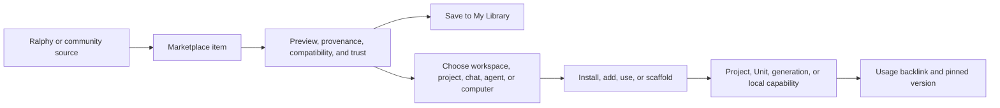

# Ralphy Desktop Marketplace — UI Design Handoff

## Purpose

Design one global **Marketplace** where creators discover, evaluate, save, install, and reuse capabilities made by Ralphy and the community.

Marketplace is the extensibility hub for Ralphy. It brings together open models, content templates, executable recipes, prompts, reusable visual components, and agent skills without pretending that every item behaves the same way.

The product promise is:

> Find a proven way to make something, understand what it needs, and bring it into the current Ralphy workflow without leaving the app.

Ralphy is an open production environment for AI-assisted content creation. Marketplace should support the positioning **“OpenDesign for content creators”**: community knowledge is inspectable, remixable, attributable, and usable by the agent rather than trapped in a gallery.

## Settled product decisions

- There is one application-level Marketplace, not separate top-level pages for Models, Skills, Prompts, or Recipes.
- The existing Local Models experience becomes the `Models` category inside Marketplace.
- Marketplace is global. Items may later be saved globally, installed on this computer, or added to a workspace or project.
- Workspace **Shared Library** remains separate. It contains a brand's reusable media and context, not community packages.
- Templates, Recipes, Prompts, Components, Skills, and Models remain distinct types with type-specific actions.
- Categories may expand over time. The shell must support new item types without redesigning the page.
- Do not show empty future categories merely to advertise possible scope.

## Placement in the application

Marketplace is a primary application destination alongside Workspaces.

Recommended global navigation:

```text
Workspaces
Marketplace
──────────
Profile / Settings
```

Chat remains an application-level right panel and may be opened while browsing Marketplace. There is no separate top-level `Chats` destination in this design.

Opening Marketplace from a workspace or project must preserve the previous location. Back returns to the exact prior page, selection, filters, and scroll position.

Marketplace must not silently inherit a workspace as the installation target. Whenever an action changes a workspace or project, the target is named explicitly.

## Relationship to existing design documents

This document owns the Marketplace shell, taxonomy, cross-category discovery, item actions, and community trust model.

Use the following category-specific documents for deeper behavior rather than duplicating them here:

- `local-models-ui-handoff.md` — model compatibility, downloads, runtime installation, verification, and removal;
- `skills-and-prompts-library-ui-handoff.md` — current Skill, Guideline, and Prompt inspection and installation constraints;
- `shared-library-ui-handoff.md` — workspace-owned reusable media and agent context;
- `content-calendar-ui-handoff.md` — publication planning and scheduled social content, which is separate from Marketplace.

Where an older document calls its surface a separate application page, this Marketplace document supersedes only that placement decision. Its detailed flows remain valid.

## Product model



Marketplace coordinates four different kinds of state:

1. **Catalog state** — what is available from Ralphy, community registries, and configured sources.
2. **Personal state** — saved, hidden, recently used, or locally forked.
3. **Machine state** — downloaded model packages, installed skills, runtimes, and updates.
4. **Workspace state** — items added to a particular brand, project, or agent working set.

The UI must never collapse all four into one ambiguous `Installed` badge.

## Item taxonomy

Marketplace presents six initial user-facing categories.

| Category | Meaning | Example | Primary use |
|---|---|---|---|
| **Models** | Open model packages or compatible local-runtime entries | A pinned video model from Hugging Face | Download, install, and select |
| **Templates** | Generalized content know-how organized by output format | A product reveal video structure | Start a project or remix |
| **Recipes** | An extractable, applicable production artifact | An FFmpeg filtergraph or encoding recipe | Apply or copy |
| **Prompts** | Reusable generation instructions with variables | A Seedance product-shot prompt | Fill and use in chat/generation |
| **Components & Effects** | Visual or audio building blocks with a preview | A HyperFrames title animation or audio hook | Add to a project/composition |
| **Skills** | Technical or operational agent capabilities | Research, evaluate, publish, or render workflow | Review and install for an agent |

### Fundamental domain types

Ralphy's durable conceptual model remains:

- **Template** — answers “How do I make this kind of content?”
- **Recipe** — contains a reusable artifact that can be applied or copied.
- **Skill** — gives an agent an operational or technical capability.
- **Model** — provides a generation capability through a provider or local runtime.

`Prompts` and `Components & Effects` are prominent Marketplace categories because users search for them directly. They may be represented as specialized Recipe kinds in the underlying catalog.

A tutorial without an extractable artifact is documentation, not a Recipe. It may be linked from an item detail page but should not appear as a reusable Marketplace item merely because it contains instructions.

### Template, Unit, and Blueprint boundary

- A Template generalizes a content format or structure.
- A Unit is one concrete finished deliverable.
- A Blueprint reproduces one exact Unit.

Marketplace may show finished Units as examples, but a Unit is not another Marketplace package type in this design. `Remix this Unit` uses its Blueprint and related Template behind the scenes.

## Source and trust model

Every Marketplace item must have visible provenance.

Recommended source labels:

- **Ralphy Official** — maintained in an official Ralphy registry;
- **Verified publisher** — publisher identity has been verified, but content is not automatically audited;
- **Community** — published by an identifiable community author;
- **Local** — created or imported on this machine;
- **External source** — linked from Hugging Face, Civitai, GitHub, or another configured registry.

Do not use a generic `Safe` badge. Distinguish:

- publisher identity verified;
- package signature or hash verified;
- content reviewed by Ralphy;
- local files modified after installation;
- no review information available.

Licenses and usage permissions remain part of item identity. `Open source`, `commercial use`, `attribution required`, and `unknown license` are not interchangeable.

## Information architecture

Use the Marketplace destination with an adaptive context sidebar and one main canvas.

### Context sidebar

```text
MARKETPLACE
  Discover
  Models
  Templates
  Recipes
  Prompts
  Components & Effects
  Skills

MY LIBRARY
  Saved
  Added to workspaces
  Installed on this Mac
  Downloads
  Updates
```

Rules:

- `Discover` is the default Marketplace landing page.
- Categories are filters over one catalog, not independent products with unrelated navigation.
- `My Library` represents user and machine state, not a second catalog.
- Hide a category only when the product does not support it at all. Do not hide it merely because the current query has no results.
- New categories use the same sidebar, browse, detail, and state patterns.
- At narrow desktop widths, the context sidebar may collapse into a category menu. The selected category remains visible in the page header.

### Main header

The Marketplace header contains:

- title or current category;
- search input;
- active source or compatibility filters;
- `My Library` summary when relevant;
- downloads indicator only when model/package jobs exist.

Search is the primary action. Do not put `Publish`, `Create`, and `Install` together as equally strong global CTAs.

## Discover home

The default view should feel like a useful production catalog, not a marketing landing page.

Recommended order:

1. **Search** — prominent but compact, with recent queries and category suggestions.
2. **Categories** — six concise category cards with real item counts where available.
3. **Continue where you left off** — saved, downloading, recently inspected, or update-required items based on real local state.
4. **Useful for your current work** — only when Ralphy can explain the current context match.
5. **Community collections** — curated sets such as `Product launch kit` or `Short-form video hooks`.
6. **Recently updated** — source-backed timestamps, not invented popularity.

Do not show fictional ratings, download counts, `Trending`, or personalized recommendations without corresponding data.

Context-aware suggestions must explain themselves:

> Works with the 9:16 video Unit currently open in Snickers / Summer Campaign.

When no workspace or project is active, Marketplace remains fully usable and omits contextual claims.

## Search and browse

Search spans:

- item name and description;
- author and source;
- format, modality, task, and tags;
- compatible agents, models, runtimes, and tools;
- recipe artifacts and prompt body where indexed;
- example Unit titles where indexed.

Universal filters:

- Category
- Task: Video / Image / Audio / Writing / Research / Publishing / Operations
- Source
- License and commercial-use permission
- State: Available / Saved / Added / Installed / Update available / Needs attention
- Compatibility with current computer, agent, workspace, or project
- Updated date

Category-specific filters appear only when that category is selected. For example, Models expose modality, format, runtime, and package size; Skills expose agent and permission requirements.

Sorting:

- Relevance
- Recently updated
- Recently used locally
- Most used by the community, only when verified usage data exists
- Name

Active filters are removable chips. Preserve query, filters, sort, selected item, and scroll position when opening and closing detail.

### Search suggestions

Suggestions may combine:

- recent queries;
- item names;
- categories;
- authors;
- tasks and formats;
- current-context shortcuts such as `Compatible with this project`.

Label keyword search honestly. Do not call it semantic or AI search until the catalog actually supports that ranking.

## Result presentation

Use a responsive mixed layout:

- compact list rows for text-heavy Skills, Prompts, and Recipes;
- preview cards for Templates, visual Models, and Components;
- a list/card switch only when both representations provide real value.

Every result includes:

- textual category label plus icon;
- name and concise purpose;
- author/source and version;
- compatibility summary;
- license/trust summary;
- saved, installed, or added state;
- one state-aware primary action.

Cards may show actual example output, live component previews, model media, or before/after demonstrations. Avoid decorative cover art that communicates nothing about the reusable item.

## Universal item detail shell

Open item detail as a full route in the Marketplace canvas. Use a wide inspector only for quick preview; dense license, compatibility, file, and example content must not be trapped in a small modal.

### Detail header

Show:

- category;
- name and outcome-focused summary;
- publisher, source, version, and update date;
- license and trust state;
- compatibility state;
- save control;
- one primary state-aware CTA.

### Shared sections

1. **What it gives you** — the concrete reusable outcome.
2. **Preview or example** — live preview, before/after, sample output, or example Unit.
3. **Use when** — tasks and trigger conditions.
4. **Do not use when** — negative scope and known limits.
5. **Compatibility** — required format, model, agent, runtime, tool, or Ralphy version.
6. **What will be added** — files, instructions, model package, project blocks, or references.
7. **Permissions and access** — files, shell, network, credentials, or runtime requirements.
8. **Version and provenance** — source, license, hash or revision, change history, and local modifications.
9. **Works with** — related Templates, Recipes, Models, Skills, or examples.
10. **Used by** — workspace/project/chat references when actual usage backlinks exist.

Type-specific sections extend this shell rather than replacing it.

## Category behavior

### Models

`Marketplace / Models` absorbs the Local Models browse experience.

Use the detailed flow in `local-models-ui-handoff.md`:

```text
Discover → select pinned package → compatibility preflight → download
→ verify → install into runtime → test → use in Ralphy
```

Within Marketplace:

- remote models appear under `Models`;
- ready models appear under `My Library / Installed on this Mac` with a Models filter;
- active downloads appear under `My Library / Downloads` and in a contextual downloads drawer;
- runtime and cache preferences remain in Settings;
- model usage begins in a compatible chat or generation workflow.

The word `Installed` means runtime registration and test succeeded, not merely that files were downloaded.

### Templates

Templates are organized primarily by output format and explain how to make a kind of content.

Detail should include:

- format and expected deliverable shape;
- beat or scene structure;
- slots and variables;
- common model stack and assets;
- composition skeleton;
- examples and common failure modes;
- related Recipes and Components.

Primary actions:

- `Start project with template`;
- `Use in current project` when compatible;
- `Open in chat` when the user wants the agent to adapt it;
- `Save`.

### Recipes

A Recipe must contain an extractable artifact.

Supported examples include:

- FFmpeg filtergraphs;
- encode settings;
- overlay or bake steps;
- HyperFrames snippets;
- prompt recipes;
- reusable transformation commands.

Detail should provide a readable how-to, copyable artifact, named parameters, required tools, preview, and applicability limits.

Primary actions depend on artifact type: `Apply`, `Add to project`, `Copy`, or `Open in chat`.

### Prompts

Prompts use a dedicated user-facing category even when stored as Recipe records.

Detail should provide:

- reusable prompt body;
- highlighted variables;
- compatible models and guidelines;
- filled example;
- expected output shape;
- version and source;
- local fork or edit state.

Primary actions:

- `Use in chat`;
- `Use in generation`;
- `Copy`;
- `Save`.

Do not execute a prompt merely by opening its detail page.

### Components & Effects

These items should be visual and immediately testable where possible.

Examples:

- HyperFrames scene or transition;
- reusable text animation;
- lower third;
- visual treatment;
- audio hook or SFX treatment;
- compositing effect.

Detail should include live or recorded preview, supported aspect ratios, duration behavior, dependencies, exposed controls, accessibility notes, and integration method.

Primary action: `Add to project` or `Open in chat`.

### Skills

Skills are agent instructions with operational capability and belong at a security boundary.

Detail and install review must show:

- supported agent harnesses;
- triggers and workflow;
- files and manifest;
- tools, shell, network, and credentials;
- user/project installation scope;
- copy or symlink behavior where supported;
- source and local modifications;
- negative scope.

Primary action: `Review install`. Never run a Skill during preview.

## State-aware actions

Do not use one generic action for all item types.

| Action | Meaning |
|---|---|
| **Save** | Bookmark globally in My Library without changing a workspace or machine |
| **Add to workspace** | Make an item available to a named workspace and its agents |
| **Add to project** | Add files, references, or configuration to a named project |
| **Install** | Change machine or agent environment state |
| **Use in chat** | Add the item to a chat working set or composer without executing it silently |
| **Use** | Select a ready capability in the compatible current workflow |
| **Copy** | Copy a reusable text or code artifact |
| **Fork** | Create an editable local derivative while preserving provenance |

After an action, show the exact result:

> Added `Kinetic Product Title` to Snickers / Summer Campaign.

Avoid vague confirmations such as `Added successfully`.

## Target chooser

Actions that require context open one compact chooser.

Possible targets:

- current chat;
- another active chat;
- current workspace;
- another workspace;
- current project;
- another compatible project;
- user-level or project-level agent installation;
- this computer and selected runtime.

The chooser preselects the current compatible context but always names it. Incompatible targets are disabled with a reason instead of disappearing.

## My Library

My Library is a management view over saved and applied state.

Recommended sections:

- Saved
- Added to workspaces
- Installed on this Mac
- Local forks
- Downloads
- Updates
- Needs attention

Use filters for category, workspace, project, source, and state. Avoid duplicating separate management pages for every type.

Every row should answer:

- what is this;
- where is it available;
- which version is active;
- what uses it;
- whether it needs attention;
- what action is safe now.

## Community collections and creator pages

Collections are curated sets of existing items, not a seventh package type.

Examples:

- `Short-form product launch kit`;
- `Local image generation starter stack`;
- `Podcast repurposing workflow`.

A collection may combine Models, Templates, Recipes, Prompts, Components, and Skills. Adding a collection still reviews each install or permission boundary; one click must not silently install arbitrary executable content.

Creator pages may show identity, source links, published items, licenses, and verified usage. Ratings, reviews, comments, follower counts, and payments require a real identity, moderation, and anti-abuse system and are not assumed by this design.

## Chat integration

Marketplace and Agent Chat should reinforce each other.

- `Use in chat` opens the existing right panel if closed.
- The selected item appears as an explicit working-set attachment.
- The user may remove it before sending.
- The agent receives a pinned item ID and version, not only copied display text.
- Chat output links back to the Marketplace item that influenced it.
- If an item requires installation, chat may open the install review but must not bypass it.

The main Marketplace content remains visible while chat is open.

## Downloads and background work

Model and package downloads continue after navigating away from Marketplace.

Do not require a permanent bottom Status Bar in the first design. Surface background state through:

- a badge or progress state on `My Library / Downloads`;
- the Marketplace header downloads control while inside Marketplace;
- the existing global activity/notification affordance when the user is elsewhere;
- a completion or attention notification.

Reserve a persistent status bar for later only if testing shows that users routinely lose track of background work.

## Publishing and contribution

Marketplace should visually support community authorship, but desktop publishing is not part of the initial shell unless a real registry contract exists.

Do not show a prominent working `Publish` button without:

- authenticated publisher identity;
- package validation;
- versioning;
- license selection;
- moderation and takedown handling;
- preview and artifact upload;
- update and deprecation behavior.

Local `Create`, `Fork`, or `Export package` actions may exist independently when their write contracts are implemented.

## Empty, loading, offline, and error states

### First use

> Build with what the community already knows
>
> Find models, templates, effects, prompts, and agent capabilities for your next piece of content.

Primary action: focus Marketplace search.

### No results

Keep the query and filters visible. Suggest another category, remove incompatible filters, or search the current source directly. Do not show a blank page.

### One source failed

Keep results from healthy sources. Name the failed source and offer retry.

### Offline

My Library and locally installed items remain usable. Discover shows cached metadata with a last-updated timestamp.

### Incompatible item

Explain the concrete mismatch and offer a safe next step: choose another format, install a runtime, open a compatible project, or use a related item.

### Removed or unavailable source

Keep locally saved or installed versions available with their last known provenance. Do not silently delete local state.

### Install conflict

Show target, files, current version, proposed version, and local modifications. Offer review, keep, fork, or replace after confirmation.

## Accessibility and interaction

- All navigation, search, filters, result cards, detail sections, and install flows are keyboard accessible.
- Category and item type always have text labels; icons are supplemental.
- Search results use semantic list or grid structures and preserve focus after updates.
- Opening and closing detail restores focus to the originating item.
- Compatibility, trust, and status never rely on color alone.
- Icon-only controls have accessible labels and visible tooltips.
- Progress uses accessible progress semantics and restrained announcements.
- Long names, licenses, file names, and source IDs wrap or expose full text on focus.
- Micro-interactions use approximately 150–300 ms and respect reduced-motion preferences.
- Lists with large result counts are virtualized without breaking keyboard navigation.
- One primary action is visually dominant per item state.

## Visual direction

Follow the existing Ralphy Desktop design tokens and dark professional workbench language. Do not import a separate app-store palette or typography system.

Use:

- strong search and clear category landmarks;
- content previews only when they demonstrate the reusable result;
- compact provenance, license, compatibility, and version metadata;
- dense list rows for operational items;
- larger preview cards for visual items;
- monospaced styling for commands, prompt variables, revisions, hashes, and IDs;
- restrained accent color for current state and the primary CTA;
- Lucide-style vector icons with consistent stroke weight.

Avoid:

- decorative NFT-like covers;
- oversized ratings and download counts;
- multiple competing gradients;
- glass effects that reduce text contrast;
- every category inventing a different visual language;
- card grids that hide important trust or compatibility information.

## Required design frames

1. Marketplace — Discover home
2. Marketplace — mixed search results
3. Marketplace — selected category and active filters
4. Marketplace — no results and partial-source failure
5. Model detail inside Marketplace
6. Model download and install entry point
7. Template detail with examples and related Recipes
8. Recipe detail with artifact and before/after preview
9. Prompt detail with variables and `Use in chat`
10. Component detail with live or recorded preview
11. Skill detail with trust and permission review
12. Target chooser — workspace, project, chat, agent, or computer
13. My Library — mixed installed, saved, and added states
14. Downloads — active, failed, and completed
15. Update/conflict review
16. Community collection combining several item types
17. Offline and unavailable-source states
18. Narrow desktop behavior with collapsed Marketplace sidebar

## Backend contract additions required

The complete design requires explicit contracts for:

- normalized cross-source catalog listing and pagination;
- stable item IDs, categories, subtypes, versions, and source provenance;
- honest search ranking and category-specific filters;
- item manifests, compatibility, licenses, trust evidence, and permissions;
- persistent saved, hidden, forked, installed, and added-to-context states;
- target enumeration for workspaces, projects, chats, agents, and runtimes;
- type-specific action plans and conflict-safe results;
- relationships between Models, Templates, Recipes, Prompts, Components, Skills, Units, and Blueprints;
- usage backlinks and pinned item versions;
- persistent background downloads and updates;
- community identity and publishing only when that feature is introduced.

Do not represent these states only in front-end memory. Marketplace state must survive restart and remain legible to agents and workflows.

## Non-goals

- Replacing workspace Shared Library
- Moving workspace-specific media into a global public catalog
- Treating every item as a downloadable app
- Inventing ratings, comments, popularity, or recommendations
- Silent installation or execution from item preview
- Automatic updates over local modifications
- A universal creator publishing flow before registry and moderation exist
- Empty navigation for speculative future item types
- A separate top-level Local Models page
- A separate top-level Skills or Prompts page
- A permanent global Status Bar in the initial design

## Product principle

Marketplace is one door into many reusable capabilities, but it must preserve what each capability actually is:

> Discover globally, inspect honestly, choose the target explicitly, and preserve provenance when the community's work becomes part of your own.
