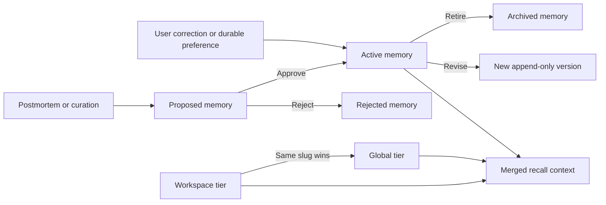

# Ralphy Desktop Memory — UI Design Handoff

## Purpose

Design the existing workspace-level **Memory** page in Ralphy Desktop.

Ralphy Memory is not a notes app, project log, or chat history. It is the durable context that helps future agents remember preferences, client facts, craft rules, model behavior, and tooling lessons across projects.

The page must make three things understandable:

1. what Ralphy currently remembers;
2. where and when a memory applies;
3. which proposed memories still require review.

The primary user promise is:

> Teach Ralphy once, inspect what it learned, and keep future work grounded without silently turning every past observation into a universal rule.

## Product model

## What a memory is

Each memory entry contains:

- **Name** — human-readable title;
- **Description** — compact index summary;
- **Slug** — stable machine identifier;
- **Type** — model, craft, tooling, client, style, or user;
- **Tier** — global or workspace;
- **Status** — active, proposed, rejected, or archived;
- **Version** — append-only revision number;
- **Filed date**;
- **Source** — where the memory came from;
- **Body** — the rule and its operating context.

The body follows a trust-oriented structure:

1. The rule
2. **Why:** the failure or confusion it prevents
3. **How to apply:** triggers and concrete behavior
4. **Does NOT apply to:** explicit negative scope

The `Does NOT apply to` section is essential. It prevents a narrow lesson from being over-applied to unrelated projects.

## Memory tiers

### Workspace memory

Workspace memory contains client-, brand-, account-, or universe-specific knowledge, for example:

- the client rejects neon color grading;
- cast master shots live in a shared workspace location;
- this brand uses a specific pacing or register;
- a channel has an established style constraint.

It applies only inside the current workspace.

### Global memory

Global memory contains cross-workspace knowledge, for example:

- model quirks;
- prompt craft;
- tooling rules;
- durable user preferences that apply everywhere.

It is inherited by every workspace.

### Effective memory

Agents receive a merged recall of active global and current-workspace entries. If both tiers contain the same slug, the workspace version wins.

The UI must explain this with plain language such as:

> This workspace memory overrides a global memory with the same ID.

Do not expose storage paths as the main mental model. Paths and raw filenames may appear in technical details.

## Memory lifecycle

### Active

Active memory is included in future agent recall.

An explicit user correction or durable preference can be written directly as active memory. The product should confirm this unobtrusively, for example:

> Saved to Memory · Workspace · Style

### Proposed

Memories extracted from postmortems, lesson routing, or curation are staged as proposals. They do not influence agents until a user approves them.

This review gate is a core trust boundary. The UI must make proposed memory visible without implying that it is already active.

### Rejected

Rejected proposals are preserved for provenance but do not affect recall. They are not deleted.

### Archived

Retiring an active memory moves all of its versions to archived state and removes it from recall. Use the user-facing verb **Retire**, not Delete.

The current system does not expose an unarchive workflow. Do not promise Restore until the backend supports it.

### Versions

Revising an existing slug creates `v2`, `v3`, and so on. Previous files remain intact. The interface must present this as `Revise memory`, never destructive in-place editing.

## Information architecture

Keep the existing workspace navigation:

- Projects
- Units
- Shared library
- Memory
- Calendar

Memory is a single workspace page. Avoid adding several permanent inner tabs. Use filters and a right-side inspector so the page remains easy to scan.

The default view is **Effective active memory**: the merged memory that agents in the current workspace actually receive.

## Main Memory screen

### Header

Show:

- page title `Memory`;
- short explanation: `Durable context agents reuse across future work`;
- primary search field;
- primary CTA `Add memory`;
- proposed-count badge when review is needed.

Optional compact summary:

- `42 active`
- `5 workspace`
- `37 inherited`
- `3 proposed`

Do not turn these counts into large dashboard cards. They support orientation but are not the content.

### Toolbar and filters

Provide:

- Scope: Effective / Workspace / Global
- Status: Active / Proposed / Archived / Rejected
- Type: Model / Craft / Tooling / Client / Style / User
- Sort: Relevance / Recently filed / Recently revised / Name
- `Clear filters`

Search is the primary navigation mechanism. The current backend performs case-insensitive substring matching across frontmatter and body. Do not imply semantic or AI search until such a backend exists.

Preserve the current query, filters, selected row, and scroll position when the user opens and closes the inspector.

### Memory list

Use a dense list or table-like collection rather than a card grid. Memory is text-first and benefits from alignment.

Each row should show:

- memory name;
- one- or two-line description;
- type;
- scope;
- status;
- current version;
- filed or revised date;
- source when useful.

Recommended row example:

> Client rejects neon grades
>
> Keep color treatments natural and product-led for Acme campaigns.
>
> Workspace · Style · Active · v3 · Revised Aug 12

Use a clear icon and label for Workspace versus Global. Do not rely on color alone.

When a workspace entry shadows a global entry, add an `Overrides global` indicator.

### Proposed review queue

When Status is Proposed, rows should emphasize:

- proposed rule;
- source project or postmortem;
- proposed tier and type;
- similar active memory, when curation found an overlap;
- missing `Why`, `How to apply`, or `Does NOT apply to` sections;
- Approve and Reject actions.

Allow multi-select only for review actions that are already supported safely, such as approving all proposals in one tier. Never mix global and workspace proposals in one ambiguous bulk approval.

## Memory inspector

Selecting a row opens a right-side inspector and keeps the list visible.

### Header

Show:

- name;
- status;
- type;
- scope;
- version;
- slug in secondary technical metadata.

### Body

Render the content with clear sections:

- Rule
- Why
- How to apply
- Does NOT apply to

If the stored body is incomplete, show a visible quality warning:

> Negative scope is missing. This memory may be applied too broadly.

CTA: `Revise and complete`.

### Provenance

Show:

- source;
- filed date;
- workspace when applicable;
- source project or postmortem link when resolvable;
- latest version;
- inherited or overriding relationship.

### Actions by status

Active:

- Revise
- View version history
- Retire

Proposed:

- Approve
- Edit before approving
- Reject

Archived:

- View history
- Copy as new proposal

Rejected:

- View provenance
- Copy as new proposal

Do not show Delete.

## Add Memory modal

Use a focused modal with progressive disclosure.

### Required fields

- Rule
- Scope: This workspace / Global
- Type

### Strongly encouraged fields

- Why
- How to apply
- Does NOT apply to

### Advanced details

- Name
- Slug
- Description
- Source

Name, slug, and description can be generated from the rule but remain editable before save. Source should normally be populated automatically.

Primary CTA: `Save active memory`.

Secondary action: `Save as proposal`.

Explain the scope beside the selector:

- `This workspace` — only agents working in the current brand or client context.
- `Global` — agents working in every workspace.

Global scope is higher impact. If selected, include a lightweight confirmation in the final review:

> Global memories affect future work in every workspace.

## Revise Memory flow

Revising opens the same structured editor prefilled with the current version.

The final action must say:

> Save as version 4

The user should be able to compare the draft with the current version before saving. Do not use language such as `Overwrite` or `Replace file`.

After save, show:

> Version 4 is now active. Earlier versions remain available in history.

## Version history

Version history can open inside the inspector or as a large secondary modal.

Show:

- chronological versions;
- filed date;
- source;
- authoring context when available;
- active version marker;
- readable diff between two selected versions.

The diff should emphasize changes to scope and behavior, especially edits to `How to apply` and `Does NOT apply to`.

Do not expose a destructive `Make this old file current` action. Reusing an old version should create a new revision.

## Proposed memory review

The review surface must answer:

1. What rule is being proposed?
2. Where did it come from?
3. Is it global or workspace-specific?
4. Does a similar active memory already exist?
5. What will change if I approve it?

For a simple proposal, show:

> Approving adds this rule to future agent context in Workspace Acme.

For an overlap merge proposed by curation, show a comparison:

- Existing active memory
- Proposed merged survivor
- Memories to retire after approval

Approval and retirement must remain separate visible operations. Do not silently retire active entries merely because a merge proposal was approved.

## Recall preview

Provide a secondary `Preview agent context` action in the toolbar.

It opens a read-only drawer showing the effective merged digest for the current workspace:

- total active entries;
- workspace and global contribution;
- which workspace entries override global slugs;
- the exact compact descriptions agents receive;
- an option to expand full bodies.

Explain:

> Active memory is background context, not an instruction override. Agents should still verify volatile facts, model availability, and current tool behavior.

This preview is valuable because it shows the user the actual consequence of active memory without requiring them to understand CLI storage.

## Curation and health review

Expose curation as a secondary action named `Review memory health`, not as an automatic cleanup.

The curation result may identify:

- overlapping memories;
- proposed merged survivors;
- missing negative scope;
- stale model or tool references.

Curation must never mutate active entries automatically. It may create proposals and recommended retirement steps.

Display results as a review list with explicit actions rather than a single `Fix all` button.

## Capacity

Each active memory tier is capped at 100 entries. Proposed entries are not part of that active cap.

When approaching capacity, show a quiet indicator in the relevant scope filter. At capacity, block another active entry and offer:

- Review overlaps
- Retire stale memories
- Save as proposal

Do not suggest deleting files or silently dropping the oldest memory.

## Empty, loading, and error states

Design all of the following:

- Effective memory with normal data
- Workspace with global memories but no workspace-specific entries
- Completely empty memory
- No proposed memories
- No search results
- Loading skeleton
- Search or load error with Retry
- Malformed memory entry
- Missing negative scope warning
- Workspace entry overriding global entry
- Proposed overlap merge
- Active tier approaching capacity
- Active tier at capacity
- Curation failed without changing active memory

Completely empty copy:

> Ralphy has no durable memory yet.
>
> Add a preference or rule that should influence future work.

CTA: `Add memory`.

No workspace-specific entries copy:

> This workspace currently uses inherited global memory only.

CTA: `Add workspace memory`.

No proposals copy:

> Nothing is waiting for review.

Do not add a celebratory illustration that competes with the content.

## Confirmation language

### Approve

> Activate this memory?
>
> It will be included in future agent context for Workspace Acme.

### Reject

> Reject this proposal?
>
> It will be preserved for provenance but will not affect future work.

### Retire

> Retire this memory?
>
> All versions will move to the archive and agents will stop recalling it.

Use `Retire`, not `Delete`.

## Accessibility and interaction quality

- Search, filters, list rows, inspector, modal, and review actions must be keyboard accessible.
- Preserve a logical tab order and visible focus states.
- Return focus to the selected row when the inspector closes.
- Status and scope must include text or icon, not color alone.
- Expanders announce expanded and collapsed state.
- Errors appear beside the relevant field and explain recovery.
- Approve, Reject, and Retire require distinct labels and accessible names.
- Destructive or high-impact actions must not be placed directly beside the primary action without separation.
- Toasts announce changes without stealing focus.
- Motion should stay around 150–300 ms, express spatial continuity, and respect reduced-motion preferences.
- Use the existing Ralphy semantic tokens and verify text contrast in light and dark themes.

## Required design frames

1. Memory / Effective active / Default
2. Memory / Workspace filter
3. Memory / Global filter
4. Memory inspector / Complete active entry
5. Memory inspector / Missing negative scope
6. Add Memory modal
7. Revise Memory / Save as new version
8. Version history and diff
9. Proposed review queue
10. Proposed overlap merge comparison
11. Recall preview drawer
12. Memory health review results
13. Empty memory
14. No workspace-specific memory
15. Capacity reached
16. Retire confirmation

Primary desktop frame: `1440 × 900`.

Density check: `1280 × 800`.

Also show the page with the workspace sidebar collapsed and with long memory names at increased text size.

## Visual direction

- Reuse the existing Ralphy Desktop design system, typography, spacing, radius, surfaces, and sidebar.
- Treat Memory as a text-first knowledge workbench, not a card dashboard.
- Use a restrained list and inspector layout with strong typography and readable line length.
- Keep technical metadata secondary until the user opens details.
- Use the existing Lucide icon language and consistent stroke width.
- Use semantic status colors only as supporting signals.
- Keep only one primary CTA per surface.
- Do not introduce a new palette or an unrelated “brain” visual metaphor.

## Non-goals

Do not design:

- a chat history viewer;
- project progress tracking;
- a general-purpose notes editor;
- semantic or AI search without a supporting backend;
- silent auto-approval of postmortem findings;
- destructive in-place editing;
- a Delete action for active, proposed, rejected, or archived memory;
- automatic retirement during curation;
- global and workspace memory as unrelated products;
- a dense dashboard of large metric cards;
- a new visual system unrelated to Ralphy Desktop.

## Product principle

> Memory is not everything that happened.
>
> Memory is the small set of durable rules and facts worth carrying into future work.
>
> The user must always be able to see, scope, review, revise, and retire what agents will remember.
