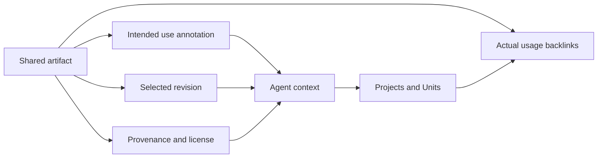

# Ralphy Desktop Shared Library — UI Design Handoff

## Purpose

Design the existing workspace-level **Shared Library** page.

The Shared Library contains reusable, workspace-owned artifacts that should stay recognizable and available across many projects: canonical characters, locations, products, logos, sound hooks, music beds, fonts, style references, recurring props, and other brand or story-world assets.

The product promise is:

> Store a reusable artifact once, explain what it represents and when to use it, then see every place where Ralphy actually used it.

The page must serve both people and agents. People need visual browsing, provenance, revisions, and usage backlinks. Agents need concise, structured context that is safer than guessing from a filename.

## Scope and placement

Keep `Shared library` in the existing workspace navigation:

- Projects
- Units
- Shared library
- Memory
- Calendar

Do not create separate permanent tabs for Characters, Locations, Products, Audio, or Brand. These are filters and roles inside one library.

The Shared Library is distinct from:

- **Project artifacts** — created for one project or Unit unless promoted;
- **Workspace shared artifacts** — reusable inside the current workspace;
- **Ralphy asset pools** — generic or licensed external media available for import;
- **Documents** — briefs and text documents, which remain unchanged;
- **Memory** — durable rules and facts, not binary/media storage.

Do not create a second workspace asset store. Redesign the existing shared-media system and enrich its metadata.

## Product model

The interface must separate two kinds of truth:

1. **Intended use** — what a human says the artifact represents and when it should be considered.
2. **Actual usage** — derived evidence showing the projects, Units, revisions, and roles where it was referenced.

Never present an intended-use label such as `Use in every video` as proof that the artifact was actually used.

## Shared artifact taxonomy

An artifact has a media kind and one or more semantic roles.

### Recommended roles

- Canonical character
- Character reference
- Location
- Product
- Logo or brand mark
- Color or style reference
- Universal sound hook
- Music bed
- Sound effect
- Voice reference
- Font
- Prop
- Recurring footage
- Intro or outro
- Overlay or texture
- Document reference
- Other

Roles should be extensible without making the initial UI a free-form taxonomy editor. Use a curated role picker plus `Other` and tags.

### Example artifacts

**Brand sonic hook**

- Kind: Audio
- Role: Universal sound hook
- Purpose: Three-second audio signature for the workspace brand
- Use when: Every externally published video, immediately after the opening visual beat
- Avoid when: Silent variants or paid placements that prohibit third-party audio
- Actual usage: 28 Units across 6 projects

**Mara — canonical front view**

- Kind: Image
- Role: Canonical character
- Purpose: Identity and wardrobe reference for the recurring character Mara
- Use when: Generating or validating any scene containing Mara
- Avoid when: The story explicitly uses the younger flashback version
- Actual usage: 14 Units across 3 projects

**Desk lamp product packshot**

- Kind: Image
- Role: Product
- Purpose: Approved product appearance and color
- Use when: Product is visible or named
- Avoid when: Showing an unreleased colorway
- Actual usage: 9 Units across 2 projects

## Artifact metadata

### Identity

- Stable artifact ID
- Human-readable title
- Media kind and MIME type
- Semantic roles
- Tags
- Named entities: character, location, product, brand, campaign, or universe
- Owner workspace
- Created and last revised dates
- Selected revision

### Agent Use Card

Every reusable artifact should have a compact **Agent Use Card**:

- **Purpose** — what this artifact is or represents;
- **Use when** — positive trigger conditions;
- **Avoid when** — negative scope and exceptions;
- **Constraints** — crop, color, duration, channel, attribution, or transformation limits;
- **Canonical status** — canonical, approved alternative, reference only, or deprecated.

These fields are descriptive context, not an arbitrary block of executable agent instructions. Avoid a generic `System prompt` field attached to media.

### File and revision

- Preview or player
- Filename and format
- Dimensions or duration
- File size
- Content hash when available
- Revision number and selected state
- Derivative relationship when the artifact is a crop, edit, or alternate format

### Provenance and rights

- Source: uploaded, promoted from project, generated, imported from asset pool, or external URL
- Original project/Unit when applicable
- Creator or provider
- License
- Attribution text
- Commercial-use and transformation restrictions when known
- Consent or release status for people/voices when relevant

Unknown rights data must be shown as `Not documented`, not assumed safe.

### Actual usage

- Total references
- Projects using the artifact
- Units and revisions using the artifact
- Usage role in each reference, such as `character reference`, `music bed`, or `opening hook`
- First and most recent use
- Whether the reference is current, historical, or broken

Usage is derived from structured references. Do not ask users to manually maintain use counts.

## Main Shared Library screen

### Header

Show:

- page title `Shared Library`;
- short explanation: `Reusable workspace artifacts for people and agents`;
- primary search field;
- primary CTA `Add artifact`;
- compact count and storage summary.

Do not turn counts into large dashboard cards. The artifacts are the main content.

### Toolbar

Provide:

- Grid / List view
- Kind filter
- Role filter
- Entity filter
- Canonical status
- Used / Unused
- Rights status
- Missing metadata
- Sort
- `Clear filters`

Suggested sorting:

- Relevance
- Recently added
- Recently used
- Most used
- Name
- Needs attention

Search covers title, role, tags, entity names, purpose, use conditions, and source metadata. Do not imply semantic search unless the backend implements it.

Preserve query, filters, scroll position, and selected artifact when returning from the inspector.

## Grid view

Grid is the default for visual media.

An artifact card shows:

- representative preview;
- title;
- kind icon;
- primary role;
- canonical status;
- selected revision;
- actual usage count;
- warning for missing rights, missing context, or broken file;
- compact media facts such as duration or dimensions.

For audio, render a restrained waveform or cover treatment with duration and a play control. Do not auto-play on hover.

For non-previewable files, use a consistent type icon and metadata summary rather than fake thumbnails.

Selecting a card opens the inspector. The card itself should not contain a cluster of editing actions.

## List view

List view is better for audit and bulk work.

Columns:

- Artifact
- Kind
- Role
- Canonical status
- Selected revision
- Used by
- Rights
- Last used
- Attention

Allow multi-select for tagging, role assignment, archive, and metadata review. Do not allow a bulk operation to replace selected revisions across active usages without a separate impact review.

## Artifact inspector

Open a wide right-side inspector on large screens and a full route or full-screen sheet on narrow windows.

### Preview area

- Image/video/audio/document preview
- Zoom or playback controls appropriate to media type
- Selected-revision badge
- File facts
- `Open original` secondary action

### Summary

- Title
- Kind and roles
- Canonical status
- Tags and named entities
- Source and rights summary
- Primary action `Use in project` or `Complete metadata`, depending on state

### Agent Use Card

Show Purpose, Use when, Avoid when, Constraints, and Canonical status in a clearly bounded section labeled:

> Context agents receive

Allow edit with a preview of the resulting structured context. Empty fields should prompt completion without inventing rules.

### Used by

Show actual backlinks grouped by project, then Unit.

Each row includes:

- project and Unit title;
- Unit revision;
- usage role;
- current or historical state;
- last referenced time;
- `Open Unit` action.

Start with a compact summary such as `28 references · 6 projects`, then allow expansion. If there are no references, say `Not used yet`; do not say `No evidence` without explaining what that means.

### Revisions

Show:

- revision thumbnail or player;
- revision number;
- created date and source;
- dimensions/duration/size;
- selected state;
- usage count pinned to that revision;
- change note when available.

Selecting a new shared revision must not silently mutate existing Units that are pinned to the previous revision.

Use an explicit action:

> Select as default for future use

Then separately offer:

> Review existing usages for update

### Technical details

Place stable IDs, object paths, hashes, MIME details, and storage class in a collapsed technical section. They are important for diagnosis but should not dominate the user experience.

## Add artifact flow

Entry points:

- Upload new file
- Promote from project
- Import from asset pool
- Add external reference when copying is not permitted

### Step 1. Select source

For upload, support drag and drop plus file picker. Show type and size constraints before transfer.

For project promotion, search recent project artifacts and preserve the source backlink.

### Step 2. Detect duplicates

Compare content hashes when possible.

If the same bytes already exist, offer:

- reuse existing artifact;
- add a new revision to it;
- create a separate semantic artifact only when the user explains why the same file represents something different.

Do not silently create duplicates based on a different filename.

### Step 3. Describe for reuse

Require only the minimum useful metadata:

- title;
- role;
- Purpose;
- Use when;
- rights status or `Not documented`.

Avoid making all metadata mandatory before an upload can finish. Save incomplete items with `Needs context` or `Rights unknown` status and route them to review.

### Step 4. Confirm

Show the preview, selected role, Agent Use Card, source, and rights. Primary CTA: `Add to Shared Library`.

## Promote from a project

Promotion makes a project artifact reusable; it must not move or delete the original project artifact.

Preserve:

- source project and Unit;
- selected source revision;
- provenance;
- existing project reference;
- content identity or hash.

Ask the user to add workspace-level meaning. A project filename such as `hook-final-3.wav` is not enough context for future agents.

After promotion, show:

> Added to Shared Library · existing project remains pinned to its current artifact.

## Revisions and updates

Create a new append-only revision when the file changes. Do not overwrite prior bytes in place.

Changing the selected revision affects future resolution. Existing Unit references remain pinned unless the user explicitly updates them.

The update-review flow must enumerate affected usages and allow:

- Update compatible usages
- Keep current revision
- Open usage for review

Do not offer `Update all` when formats, dimensions, durations, or rights differ without a compatibility check.

## AI-assisted metadata

AI may suggest:

- title;
- media kind;
- roles;
- named entities;
- short purpose;
- possible usage constraints;
- duplicate candidates.

Suggestions must be visually labeled and reviewed before becoming canonical context. The model must not infer licenses, consent, identity, or universal-use rules from media alone.

Recommended pattern:

> Suggested from file content · Review 4 fields

Show the source of each suggestion and allow accepting fields individually.

## Agent behavior contract

Agents consuming the library should receive:

- stable artifact identity;
- selected revision;
- relevant Agent Use Card fields;
- media facts;
- provenance and rights constraints;
- current workspace scope;
- actual usage evidence only when useful to the task.

The UI should explain that:

- `Canonical` means preferred identity/reference, not mandatory inclusion;
- `Use when` is a trigger, not proof of past use;
- `Avoid when` is negative scope;
- actual backlinks are system-derived;
- a deprecated artifact should not be selected for new work.

## Collections and relationships

Avoid building a full folder system initially. Roles, entities, tags, and search cover the core need without forcing each artifact into one hierarchy.

Support lightweight relationships in detail:

- character → alternate views or voice reference;
- product → packshots, logo, UI screenshots;
- location → establishing shot, interiors, textures;
- audio hook → approved mixes and channel variants.

Represent these as related artifacts, not copies nested in arbitrary folders.

## Rights and attention states

Attention labels:

- Needs context
- Rights unknown
- Missing file
- Broken reference
- Deprecated
- Duplicate candidate
- Revision update available

Rights labels:

- Cleared
- Cleared with conditions
- Internal/reference only
- Not documented
- Restricted

Rights state is not legal advice. Show the recorded evidence and source rather than asserting more certainty than the metadata supports.

## Archive and removal

Use `Archive` for artifacts that should no longer be selected for new work.

Before archiving, show:

- active and historical reference counts;
- projects and Units affected;
- whether the artifact is currently canonical;
- whether another artifact replaces it.

Archiving must preserve existing references and provenance.

Permanent local byte removal is a separate technical action and must be blocked or explicitly reviewed when active references exist. Do not place a casual trash icon on every card.

## Empty, loading, and error states

### Empty workspace library

> Build a reusable source of truth
>
> Add canonical characters, locations, products, audio hooks, and brand assets for future projects.

Primary CTA: `Add artifact`.
Secondary action: `Promote from project`.

### No search results

Keep filters visible, offer `Clear filters`, and suggest searching by role, entity, or title.

### Partial metadata

Allow the artifact to remain usable according to its rights status, but make missing context obvious and provide `Complete metadata`.

### Missing media

Preserve the metadata and usage backlinks. Show `Locate file` or `Restore revision`; never replace the missing object silently.

### Failed preview

Show file facts and download/open-original actions. A preview failure does not automatically mean the source file is corrupt.

## Accessibility and interaction

- Cards and rows are fully reachable by keyboard.
- Grid/list selection, multi-select, filters, and inspector controls have visible focus.
- Media playback has labeled play, pause, seek, mute, and volume controls as applicable.
- Audio waveforms include duration and textual state.
- Status never relies on color alone.
- The inspector restores focus to the originating artifact when closed.
- Drag-and-drop always has an equivalent file-picker or command action.
- Hover and state transitions use approximately 150–300 ms and respect reduced-motion preferences.
- Text remains readable over image previews through stable surfaces, not fragile gradients alone.

## Required design frames

1. Shared Library — populated grid
2. Shared Library — audit list with filters
3. Artifact inspector — canonical character
4. Artifact inspector — universal sound hook with player and usages
5. Artifact inspector — product with rights constraints
6. Used by — expanded project and Unit backlinks
7. Revisions — selected default and pinned existing usages
8. Add artifact — upload and metadata steps
9. Promote from project — source selection and confirmation
10. Duplicate detected
11. AI metadata suggestions awaiting review
12. Empty, no-results, missing-file, rights-unknown, and broken-reference states
13. Archive impact confirmation
14. Narrow desktop window behavior

## Visual direction

Follow the existing Ralphy Desktop design system.

Use:

- media-forward previews with calm metadata hierarchy;
- compact role, canonical, rights, and attention badges;
- a dense list for audit work;
- consistent image, video, audio, and file preview treatments;
- monospaced styling only for IDs, hashes, and paths;
- clear separation between `Context agents receive` and `Actual usage`.

Do not create a decorative mood-board product. This is an operational source of truth.

## Existing contract to preserve

Ralphy already exposes workspace shared media with selected revisions, storage class, media kind, provenance, `usageRoles`, and reference counts. The redesign should build on those concepts.

The current reference resolution order remains:

1. project references;
2. workspace shared references;
3. global references.

The design must not hide this behind accidental filename matching.

## Backend contract additions required

The richer interface requires structured fields for:

- title, roles, tags, and named entities;
- Purpose, Use when, Avoid when, Constraints, and canonical status;
- license, attribution, consent, and provenance evidence;
- actual usage backlinks down to project, Unit, revision, and usage role;
- artifact and revision relationships;
- attention states and metadata completeness;
- duplicate detection by content identity;
- archive/deprecation and replacement relationships;
- promotion without destructive source movement.

Do not represent these as front-end-only labels that agents cannot consume.

## Non-goals

- A second asset storage system
- Replacing the project Media or Documents surfaces
- A generic stock-media marketplace
- A complex folder hierarchy
- Automatic license or consent inference
- Silent revision replacement across existing Units
- A free-form system prompt attached to every artifact
- Community sharing or public publishing

## Product principle

The Shared Library is useful only when every reusable artifact answers two different questions:

> What is this for, and where was it actually used?

The first answer is curated context. The second is system-derived evidence. The interface must always preserve that distinction.
