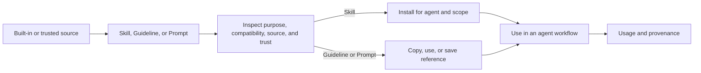
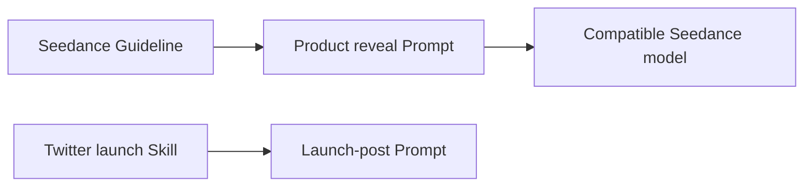

# Ralphy Desktop Skills & Prompts Library — UI Design Handoff

## Purpose

Design one global **Agent Library** for finding, understanding, installing, saving, and using reusable Skills, Guidelines, and Prompts.

Examples:

- a Skill that runs an end-to-end workflow for writing strong Twitter/X posts;
- a Guideline that teaches an agent how to write prompts for Seedance;
- a Prompt that generates a product video concept with reusable variables.

The product promise is:

> Find the right reusable agent knowledge, understand what it will do, and use it without guessing whether it is a workflow, a model rule, or a block of text.

## Placement in the application

The Agent Library belongs at application level, not as several new workspace tabs.

Installed Skills can target user-level or project-level agent environments. Prompt and Guideline catalogs may be reused across workspaces. A workspace may save, pin, or override an item later, but the source library should remain one place.

Recommended application label: **Agent Library**. Use `Skills & Prompts` as the explanatory subtitle.

This avoids confusion with the workspace's media-focused **Shared Library**.

Keep the existing workspace navigation unchanged.

## Product model

## Classification model

The interface must distinguish four concepts.

| Type | What it is | Example | Primary action |
|---|---|---|---|
| **Skill** | An operational workflow or capability with instructions, triggers, files, and possibly tool use | Research a topic and write a Twitter/X thread | Review and install |
| **Guideline** | Rules for writing prompts for a model, medium, or register | Seedance prompting rules and examples | Use with prompt |
| **Prompt** | Reusable concrete instruction text or recipe, often with variables | Generate three 9:16 product-launch concepts | Copy or use |
| **Template** | Repeatable content/project structure | A product-launch video template | Out of scope; keep in the existing Template system |

Do not label everything as a Prompt.

### Seedance example

Seedance-specific knowledge usually belongs in **Guidelines** when it explains how to phrase shots, motion, camera behavior, or constraints for that model.

A reusable concrete Seedance request belongs in **Prompts**.

An end-to-end workflow that researches references, writes the prompt, generates variants, evaluates them, and selects a result belongs in **Skills**.

### Twitter/X example

`Write a high-performing Twitter/X post` is a **Skill** when it includes research, voice, drafting, revision, format checks, and output rules.

`Rewrite this claim as five concise hooks: {{claim}}` is a **Prompt**.

## Existing Ralphy contracts and honest limitations

The UI should be designed against current behavior rather than an imagined marketplace.

### Skills

The current Ralphy skill command installs the Ralphy skill bundle for supported agents and can scaffold a new skill. Installation supports:

- agent: Claude, Cursor, or Codex;
- scope: user or project;
- mode: copy or symlink;
- user and maintainer namespaces.

Current installation is bundle-level, not a proven remote per-skill marketplace contract. Do not show individual one-click installation from arbitrary authors until source verification, file manifests, and per-skill installation exist.

### Guidelines

Ralphy Guidelines are reusable LLM prompt-writing rules. Their structured metadata includes name, slug, kind, tag, tagline, description, compatible models, tags, and version, with a Markdown body and optional examples.

They can be listed, inspected, and applied through a stable guideline tag. This is the right existing concept for Seedance-specific prompting knowledge.

### Prompts

The prompt library currently stores entries with:

- slug;
- goal;
- `applies_to` targets;
- tags;
- body;
- source path.

Lookup uses keyword overlap and substring matching. Search must not be labeled `Semantic`, `AI search`, or `Recommended for you` until such ranking exists.

### Templates

Templates remain a separate product concept and command surface. The Agent Library may link to a compatible Template, but must not absorb Template browsing or installation into its first design.

## Information architecture

Use a single search-first page.

Header:

- page title `Agent Library`;
- subtitle `Skills, Guidelines, and Prompts for reusable agent workflows`;
- primary search;
- source/status filters;
- installed-items indicator;
- primary CTA only when a supported authoring or import flow exists.

Do not create three permanent navigation tabs. Use entity-type filters:

- All
- Skills
- Guidelines
- Prompts

Installed, saved, built-in, and workspace-specific states are filters, not additional top-level tabs.

## Search and filters

Search covers:

- name and goal;
- description;
- triggers;
- tags;
- compatible model or agent;
- prompt body where indexed;
- source and author.

Filters:

- Type: Skill / Guideline / Prompt
- Task: Video / Image / Audio / Writing / Research / Coding / Operations / Other
- Model: Seedance, supported local models, provider models, or model families
- Agent: Codex / Claude / Cursor / Any
- Status: Available / Installed / Saved / Update available / Needs attention
- Scope: Built-in / User / Project / Workspace
- Source: Ralphy / Local / Trusted registry
- Trust: Verified source / Local / Unreviewed

Sorting:

- Relevance
- Recently updated
- Name
- Recently used
- Most used locally, when actual usage data exists

Do not rank by fictional community ratings or download counts.

Active filters are removable chips. Preserve query, filters, selected item, and scroll position when returning from detail.

## Result cards

Use a compact list or responsive card list. The content is text-heavy; avoid a visual marketplace grid dominated by decorative covers.

Every result shows:

- type icon and label;
- name;
- one- or two-line purpose/goal;
- key tags;
- compatible model, task, or agent;
- source and version;
- installed/saved state;
- trust label;
- primary action.

Primary actions:

- Skill: `View skill` or `Review install`
- Guideline: `Use guideline`
- Prompt: `Use prompt` or `Copy`
- Installed item with update: `Review update`

The card must not hide the item type behind an icon alone.

## Skill detail

Open a full detail route or wide inspector.

### Header

Show:

- `Skill` label;
- name and short purpose;
- source, author/namespace, and version;
- compatible agents;
- install state and scope;
- trust state;
- primary CTA `Review install`, `Use`, or `Review update`.

### Core sections

1. **What it does** — outcome and workflow summary.
2. **Use when** — trigger conditions and example requests.
3. **Do not use when** — negative scope and known boundaries.
4. **Workflow** — concise steps the skill follows.
5. **Agent and model compatibility** — supported agents, models, or runtimes.
6. **Tools and access** — files, network, shell, browser, external services, or credentials it may use.
7. **Files** — manifest and readable preview of `SKILL.md` plus relevant bundled resources.
8. **Examples** — sample input and expected output shape.
9. **Version and source** — namespace, source path/URL, version, update history, and local modifications.

Raw instructions may be displayed, but the first view should explain behavior in product language.

### Trust review

Skills are executable instructions for an agent and belong at a security boundary. Before installation, show:

- exact source;
- publisher or local namespace;
- version;
- file manifest;
- requested tools and likely side effects;
- whether network or credentials may be used;
- install target;
- whether installation copies or symlinks files;
- any unreviewed or changed local files.

Do not use a generic `Safe` badge that implies code-level auditing when only the source identity is known.

## Skill installation flow

Match the actual supported choices.

### 1. Choose agent

- Codex
- Claude
- Cursor

Disable unsupported destinations with an explanation.

### 2. Choose scope

- User — available across projects for that agent
- Project — available only in the selected project/repository

Explain the actual filesystem effect in plain language.

### 3. Choose mode

- Copy — independent installed files
- Symlink — follows the source and is suitable for local development

Recommend the safe default based on existing Ralphy behavior; keep the alternative under advanced settings.

### 4. Review

Show source, target, scope, files, mode, version, and trust notes. Primary CTA: `Install`.

### 5. Result

Show installed location, agent, scope, version, and a concrete example of how to invoke the skill.

If current backend behavior installs a bundle, the confirmation must say `Install Ralphy skill bundle` and enumerate included Skills. Do not visually pretend that only the open detail item will be installed.

## Guideline detail

### Header and summary

Show:

- `Guideline` type;
- name, tagline, and description;
- models and tags;
- version and source;
- primary action `Use guideline`.

### Body

Present:

- core rules;
- model-specific constraints;
- positive prompting patterns;
- negative scope or known non-applicable cases;
- examples;
- stable invocation tag such as `@guideline:<slug>` in technical details.

### Use action

`Use guideline` opens a small chooser:

- add to current prompt draft;
- copy invocation tag;
- open a compatible Prompt;
- choose a compatible model when the current one conflicts.

Do not duplicate the entire guideline into every prompt by default if a stable reference is supported.

## Prompt detail

### Header

Show:

- `Prompt` type;
- goal;
- applicable models/tasks;
- tags;
- source;
- saved state;
- primary action `Use prompt`.

### Prompt body

Render the reusable text in a readable editor-like surface with:

- variables clearly highlighted;
- copy button;
- line wrapping;
- raw/preview toggle only when formatting differs materially;
- no automatic execution.

### Variables

Extract known placeholders into a small form when the syntax is supported.

For example:

- `{{product}}`
- `{{audience}}`
- `{{tone}}`
- `{{duration}}`

Unknown syntax remains editable text. Do not build a universal prompt parser before one stable variable format exists.

### Examples and provenance

Show:

- sample filled prompt;
- expected output shape, not a guaranteed output;
- compatible Guideline links;
- source and version;
- local edits or fork state.

### Actions

- Use in current generation
- Copy
- Open with compatible model
- Save to workspace, only when a persistent workspace prompt contract exists
- Duplicate/fork, only when editable local entries are supported

Do not show a working `Save` state backed only by browser memory or temporary front-end state.

## Combined use flow

The library should make relationships visible without merging the entities.

Example:

On a Prompt detail page, show compatible Guidelines, models, and Skills under `Works with`.

On a Skill detail page, show included or recommended Prompts without claiming ownership of unrelated library entries.

If a required local model is not installed, link to Local Models with the model filter applied and preserve the current draft.

## Installed and saved states

### Skill states

- Available
- Install review required
- Installed for user
- Installed for project
- Local development symlink
- Update available
- Modified locally
- Conflict
- Install failed
- Source unavailable

### Guideline and Prompt states

- Built-in
- Available
- Saved
- Forked locally
- Update available
- Local changes
- Missing source

Only show states supported by persistent data. `Recently used` requires actual usage recording, not a click on the detail page.

## Updates and diffs

Updates must be reviewable.

For Skills, show:

- installed version and available version;
- changed files;
- changes to tools/access declarations;
- readable instruction diff;
- local modifications that may be overwritten.

For Guidelines and Prompts, show:

- rule/body diff;
- compatibility metadata changes;
- variable changes;
- source/version change.

Never auto-update a locally modified Skill or Prompt without preserving or explicitly replacing those changes.

## Authoring and import

The first design may expose only supported actions:

- `Create Skill` can launch the existing skill scaffolding flow if desktop support is implemented;
- local Prompt or Guideline authoring requires a real write contract, validation, and versioning;
- importing from a URL requires source verification and is not part of the initial release.

Do not place a prominent `Publish` button in the header. There is no community registry, account model, moderation flow, or publishing contract yet.

## Security and prompt-injection boundaries

- Treat Skill instructions and Prompt/Guideline bodies from external sources as untrusted content.
- Do not execute a Skill while previewing it.
- Show requested tools, network access, credentials, and mutation scope before installation or use.
- Preserve exact source and version.
- Do not render embedded HTML or scripts as trusted UI.
- Never expose full credential values inside item detail.
- Clearly distinguish `Source verified` from `Content audited`.
- Warn when a Skill's installed files differ from the known source.
- Keep external links explicit and do not silently fetch or install from them.

## Empty, loading, and error states

### First use

> Reuse workflows and prompts that already work
>
> Browse Ralphy Skills, model Guidelines, and concrete Prompts for your next task.

Primary CTA: focus search.
Secondary action: `Browse all`.

### No results

Keep the query, show active filters, and offer `Clear filters`. Explain that current search is keyword-based when a natural-language query has no match.

### No compatible agent

Explain which agent destinations the Skill supports. Do not allow a forced install into an unknown format.

### Install conflict

Show exact target files and options:

- keep installed version;
- review diff;
- replace after confirmation;
- choose another scope when valid.

### Source unavailable

Keep locally installed content usable and label the last known source/version. Do not silently remove it.

### Corrupt entry

Show validation errors in product language and allow opening technical details or source file.

## Accessibility and interaction

- Search, filters, result list, detail sections, and installation flow are keyboard accessible.
- Item type and state always have textual labels.
- Focus returns to the originating result after closing detail.
- Copy actions announce success without stealing focus.
- Code/prompt surfaces support selection, wrapping, and sufficient contrast.
- Long instructions are navigable with headings; do not trap them in a tiny scrolling modal.
- Trust and destructive warnings do not rely on color alone.
- Hover and state transitions use approximately 150–300 ms and respect reduced-motion preferences.
- Install confirmation names the agent, scope, target, and files in accessible text.

## Required design frames

1. Agent Library — all item types
2. Search results — Seedance query with Guideline and Prompt results
3. Search results — Twitter/X workflow query
4. Skill detail — workflow, triggers, tools, source, and trust
5. Skill install — agent, scope, mode, and review
6. Bundle-install disclosure
7. Skill update — instruction and access diff
8. Guideline detail — Seedance rules and examples
9. Prompt detail — variables, body, compatibility, and use actions
10. Combined `Works with` relationships
11. Local model missing — cross-link to Local Models
12. Installed, locally modified, conflict, and source-unavailable states
13. Empty, no-results, invalid-entry, and install-failure states
14. Narrow desktop window behavior

## Visual direction

Follow the existing Ralphy Desktop design system. Do not make the page look like an app store with decorative cover art, oversized ratings, or invented popularity metrics.

Use:

- text-first result rows;
- clear type labels;
- small task/model/agent chips;
- stable source and trust indicators;
- readable prompt and instruction surfaces;
- monospaced styling for invocation tags, variables, paths, and IDs;
- one primary action per item state.

## Backend contract additions required

The complete design requires explicit contracts for:

- normalized listing across Skills, Guidelines, and Prompts;
- searchable metadata and honest ranking mode;
- per-item source, version, manifest, compatibility, and trust data;
- per-skill installation plans and results, or explicit bundle installation;
- agent/scope/mode detection and conflict-safe install;
- persistent saved/forked Prompt and Guideline state;
- update checks and readable diffs;
- usage backlinks;
- relationships between Skills, Guidelines, Prompts, Templates, and local models;
- validation and versioning for authored entries.

Do not fake installed, saved, update, or compatibility states in the UI before these contracts exist.

## Non-goals

- A public community marketplace
- Ratings, comments, creator payments, or moderation
- Automatic installation from arbitrary URLs
- Silent execution during preview
- Treating Templates as Prompts
- Semantic search before a semantic index exists
- Per-item installation when the backend only installs a bundle
- Automatic Skill or Prompt updates over local changes
- Duplicating the library inside every workspace

## Product principle

The Agent Library should make reuse safer by preserving meaning and trust:

> Skill is a workflow. Guideline is model-specific prompt craft. Prompt is reusable text. Template is a content structure.

If the interface keeps those boundaries clear, users can find and use the right object without learning Ralphy's internal file layout.
