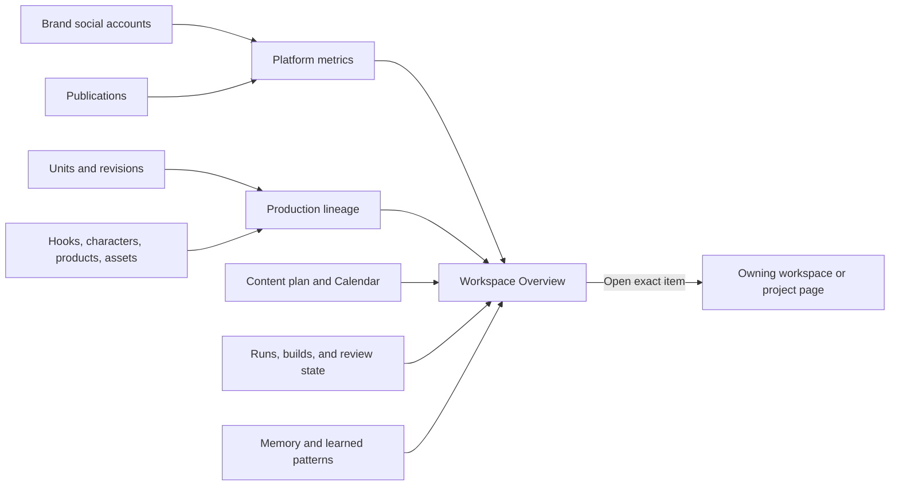
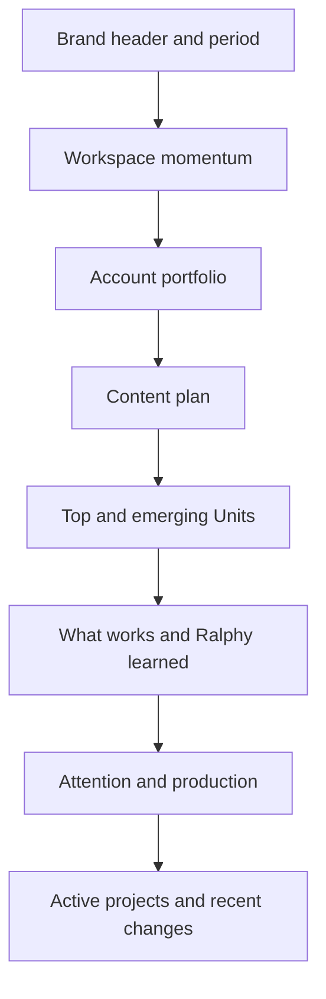

# Ralphy Desktop Workspace Overview — UI Design Handoff

## Purpose

Replace the visible project-level **Overview** tab with one workspace-level **Overview** page.

The workspace represents one brand, creator identity, campaign universe, or thematic group of social accounts. For example, a company SMM manager may create one Snickers workspace containing the brand's TikTok, Instagram, YouTube, and other accounts, together with all projects, Units, reusable assets, publishing plans, and accumulated learnings for that brand.

The workspace Overview is the brand's social-content command center. It should answer six questions:

1. How are all connected social accounts performing?
2. Is the workspace gaining or losing momentum?
3. Which Units are producing the strongest results?
4. What content is planned next, and are there gaps?
5. What has Ralphy learned about what works for this brand?
6. What needs attention now?

The product promise is:

> See how the brand is performing, understand what content works, know what is coming next, and resolve anything blocking the plan.

The page must demonstrate Ralphy's value after weeks and months of use. It should connect social results back to the Units, revisions, hooks, formats, characters, products, and reusable assets that produced them. Projects, Units, Shared Library, Memory, and Calendar remain the places where detailed work happens.

## Why remove Project Overview

The current project Overview repeats information that already has a better home:

- selected and ready content belongs in **Units**;
- distribution and publishing belong in the Unit inspector and **Calendar**;
- documents belong in **Documents**;
- media belongs in **Media**;
- execution history belongs in **Activity**;
- project status and purpose belong in the persistent project header.

An Overview for one project therefore adds another click without creating a distinct user job.

The workspace level is different. It combines all accounts, published Units, content plans, and production signals for one brand. It can show whether the brand is improving, which content patterns are working, what is scheduled across channels, and where production needs intervention.

## Navigation decision

Recommended workspace navigation:

1. Overview
2. Projects
3. Units
4. Shared library
5. Memory
6. Calendar

Recommended project navigation:

1. Units
2. Documents
3. Media
4. Activity

Remove only the visible project `Overview` tab. Do not remove the underlying `project.overview` Core/bridge contract: Units and other project views currently use parts of that data for lifecycle, publications, runs, and metrics.

When a project opens:

- restore the user's last open project tab when a valid saved state exists;
- otherwise open **Units**;
- show project name, short purpose/brief, and state in the persistent project header;
- deep links continue to open the exact Unit, document, media artifact, or activity event.

## Product model

Overview connects results, plans, learnings, and operational state. It summarizes and routes; it does not become the editor for any of these systems.

## Core design principle

Prioritize **evidence of progress over dashboard completeness**.

Every section must either:

- show how the brand or one of its accounts is performing;
- connect an outcome to the content that produced it;
- reveal an evidence-backed pattern Ralphy can reuse;
- show the upcoming content plan and its coverage;
- identify something that needs a decision;
- show work currently moving;
- provide a useful continuation shortcut.

The desired feeling is not `a system monitor is healthy`. It is:

> Ralphy is helping this brand publish consistently, learn from results, and make the next Units better.

If a number has no time period, comparison, evidence, or useful destination, it does not belong on the Overview.

## Information architecture

Use one scrollable page with the following order:

1. Workspace header and reporting period
2. Workspace momentum
3. Social account portfolio
4. Content plan and upcoming publishing
5. Top and emerging Units
6. What works and what Ralphy learned
7. Production efficiency
8. Attention, production pulse, and in-progress work
9. Active projects and recent meaningful changes

The first desktop viewport should establish brand performance and plan health. Critical attention remains visible as a compact alert summary in the header and expands in the operational section below.

Recommended large-window structure:

At narrower desktop widths, collapse to a single column in the same priority order. Do not create horizontally scrolling dashboard cards.

## Workspace header

Show:

- workspace name;
- short brand/theme description;
- connected-account summary;
- reporting-period selector;
- comparison period;
- current timezone used by Calendar;
- last successful refresh;
- data-freshness or degraded-state indicator when necessary;
- compact critical-attention count when non-zero.

Primary CTA:

- `New project` only when a real project-creation flow exists;
- otherwise omit the primary CTA rather than showing a dead control.

Secondary actions may include:

- Search workspace
- Manage social accounts
- Open workspace settings
- Refresh

Do not show the workspace slug or filesystem path as prominent content. Keep technical identity under details/settings.

## Reporting period and comparison

Default to **Last 30 days**, compared with the immediately preceding 30 days. This matches the monthly review rhythm of an SMM manager who wants to evaluate whether the workspace is improving.

Supported choices when the backend can return consistent windows:

- 7 days
- 30 days
- 90 days
- Custom range

Show the exact dates and workspace timezone. Production-state counts such as `Needs review` remain current and do not change with the reporting period.

Only show comparison percentages when:

- both windows are complete;
- both use the same metric definitions and account set;
- data freshness is sufficient;
- the denominator is large enough to avoid meaningless extreme percentages.

## Workspace momentum

This is the primary value block. It summarizes whether the brand's content operation is producing results.

Recommended headline:

> 24 Units published · 1.8M views · 312h watch time
>
> Views increased 43% compared with the previous 30 days

Primary metrics:

- published Units;
- child publications across accounts;
- views;
- watch time;
- engagement count or rate when its definition is stable;
- publishing consistency or plan completion;
- follower/subscriber growth only when providers expose a reliable comparable time series.

Use one compact trend chart for a selected metric such as Views, Watch time, or Engagement. A line chart is appropriate because the question is change over time. Limit visible series; do not draw one line per account by default.

The chart must include:

- explicit time axis and metric unit;
- previous-period comparison when selected;
- visible summary of the main trend;
- keyboard-accessible points or a data-table alternative;
- loading, empty, partial-data, and source-failure states;
- no animated streaming treatment because social metrics update periodically, not in real time.

Do not invent a composite `Ralphy score`. Ralphy should feel valuable through clear outcomes and accumulated insight, not gamification.

## Social account portfolio

Show how every connected brand account is doing in one scannable strip or compact grid.

Account examples:

- TikTok · `@snickers`
- Instagram · `@snickers`
- YouTube · `Snickers`
- X · `@SNICKERS`

Each account card shows:

- official platform mark and handle;
- connection/sync health;
- last successful sync;
- publications in the selected period;
- primary platform metric such as views;
- engagement or watch time when available;
- change versus the previous comparable period;
- next scheduled publication;
- small attention indicator when relink or publishing action is required.

Account cards must not imply that raw numbers are directly comparable across platforms. TikTok views, YouTube views, and Instagram reach may have different definitions. Comparison belongs within the same account/platform over time.

Selecting an account opens a detail drawer with:

- metric trend;
- top Units on that account;
- upcoming content;
- recent publication failures;
- data-source freshness;
- `Open Calendar filtered to account`;
- account management/relink action when necessary.

When a provider does not expose a metric, show `Not available from provider`; do not convert unknown into zero.

## Content plan

The Overview must answer whether the brand has enough content planned across all accounts.

Show a compact next-14-days planning view with:

- scheduled content events by day;
- ready Units not yet scheduled;
- planned items that still need work;
- account/platform coverage;
- obvious empty periods;
- blocking publication or account issues.

### Plan coverage

If the workspace has configured cadence goals, show progress by account:

> TikTok · 8 of 10 planned this month
>
> Instagram · 6 of 8 planned
>
> YouTube Shorts · 3 of 4 planned

Use compact bullet/progress treatments with numerical values and target labels. Do not label a date as a `content gap` unless a cadence target exists for that account.

If cadence goals are not configured, show schedule density without judging it and offer `Set publishing cadence` only when settings support that contract.

### Upcoming publishing

Show the next near-term commitments from Calendar.

Each content event shows:

- scheduled date and time in the workspace timezone;
- Unit thumbnail and title;
- project;
- selected revision;
- platform/account icons with accessible labels;
- child-publication state;
- warning when one channel needs attention.

Group several channels for the same Unit and time into one content event, matching the Calendar mental model.

Actions:

- Open in Calendar
- Open Unit
- Review problem when blocked

Do not provide drag-and-drop rescheduling on Overview. Calendar owns scheduling interactions.

Empty state:

> Nothing scheduled in the next 14 days.

Secondary actions: `Open Calendar` and, when available, `Schedule ready Units`.

## Top and emerging Units

This is the strongest proof of value after the user has published content for several weeks.

Use media-forward Unit cards grouped into:

- **Top performers** — enough observation time and clearly above the relevant benchmark;
- **Emerging** — recently published Units gaining results faster than comparable content;
- **Learning opportunities** — mature Units performing below the workspace baseline and useful for comparison.

Avoid the label `Failed content`.

Each Unit card shows:

- preview;
- Unit and project title;
- selected/published revision;
- account/platform destinations;
- age since publication;
- views, watch time, and engagement where available;
- result relative to a relevant workspace median;
- strongest account result;
- primary action `Open Unit`.

Example:

> Product Reveal v5
>
> 428K views · 2.3× the TikTok 7-day workspace median
>
> Strongest result on TikTok · published 9 days ago

### Fair comparison rules

Do not rank by raw lifetime totals alone. Normalize comparisons by:

- platform/account;
- observation window, such as first 24 hours or first 7 days;
- content rail or format where materially different;
- known metric definitions;
- publication age and data freshness.

One Unit may have several child publications. Show the Unit as the creative object and allow expansion into channel-specific results.

## What works

Ralphy's differentiator is the ability to connect social outcomes back to production lineage.

Potential explanatory dimensions:

- opening hook;
- duration;
- composition and pacing;
- character;
- product or product framing;
- location;
- audio or universal sound hook;
- aspect ratio and platform adaptation;
- Shared Library artifact roles;
- prompt/guideline or model metadata when recorded consistently.

Insight cards may say:

> Product close-up openings perform 1.7× above the workspace median
>
> TikTok · 9 comparable Units · last 90 days

or:

> The brand sonic hook appears in 6 of the top 10 Instagram Units
>
> Evidence is not yet strong enough to claim lift

Every insight must show:

- observation, not causal overclaim;
- platform/account scope;
- reporting window;
- sample size;
- comparison baseline;
- confidence or evidence-strength label;
- linked supporting and counterexample Units;
- relevant artifact, hook, character, or format definition.

Use language such as `associated with stronger performance`, not `caused the increase`, unless a controlled experiment supports causality.

Do not generate an insight for tiny samples. In insufficient-data states, explain what additional comparable publications are needed.

## What Ralphy learned

Translate supported observations into reviewable workspace knowledge.

Example:

> Ralphy learned this month
>
> - Product-first openings are associated with stronger TikTok performance.
> - Units between 18 and 24 seconds retain viewers longer on Instagram Reels.
> - The brand sonic hook frequently appears in top Instagram Units but shows no measurable YouTube lift yet.

Actions:

- Review evidence
- View matching Units
- Save as proposed Memory
- Open existing Memory when already captured
- Create a variation only when a real generation flow can prefill the evidence and source Unit

Learnings must remain proposed until reviewed. Never silently turn correlations into active universal rules.

## Production efficiency

Show how Ralphy improves the content operation, but keep this secondary to audience outcomes.

Useful metrics when reliably recorded:

- Units created and published;
- median time from Unit creation to selected revision;
- median revisions before selection;
- generation cost per published Unit;
- percentage of published Units adapted to several platforms;
- reuse of approved Shared Library artifacts;
- production-to-publication conversion.

Example:

> 24 published Units · median production time 42m · 68% reused approved brand assets

Do not call this financial ROI unless revenue or another business outcome is actually connected.

## Production and Attention

Operational state remains important, but it follows the brand results and plan.

Use a two-column desktop section:

- left: Attention;
- right: Production pulse and In progress.

At narrow widths, Attention comes first.

## Attention

Attention is a prioritized queue of items that require user action or acknowledgement across the workspace.

### Included signals

- Unit needs review
- Unit or build is blocked
- Run or render failed
- Publication failed
- Publication needs reconciliation
- Connected account needs relinking
- Scheduled publication is missing a usable selected revision
- Memory proposals await review
- Shared artifact has a broken reference or blocks active work
- Project has a conflict that prevents progress

Do not include informational events such as `Unit created` or `file indexed`.

### Priority order

1. Publishing and data-integrity failures
2. Blocked production work
3. Human review required
4. Credential/account actions
5. Governance review such as Memory proposals or asset metadata

Within a priority, order by urgency and recency. A scheduled publication failing in two hours ranks above an old inactive-project warning.

### Attention row

Each row contains:

- severity icon and text label;
- concise problem title;
- project and Unit context when applicable;
- age or deadline;
- one primary resolution action;
- secondary `Open details` action when different.

Example:

> Publication failed · TikTok · Product launch v4
>
> Campaign Q3 · 18 minutes ago
>
> `Review publication`

Never offer a generic `Fix` action when the product cannot explain what will happen.

### Deduplication

Group repeated failures caused by the same root issue.

Example:

> Instagram account needs relinking
>
> Affects 4 scheduled publications in 3 projects

The account problem should appear once, with affected items in the inspector, instead of four nearly identical rows.

### Section behavior

- show up to five highest-priority items initially;
- provide `View all attention` when more exist;
- allow filtering by subsystem in the expanded view;
- removing or resolving an item must update the queue without changing scroll unexpectedly;
- dismissed warnings require a durable backend state and reason; do not implement front-end-only dismissal.

## In progress

Show the workspace's active production work, not every recently updated record.

Include:

- running agent tasks;
- active renders/builds;
- Units currently being revised;
- Units waiting for a known next step;
- recent work the current user opened and can continue.

Each row or compact card shows:

- Unit title and thumbnail when available;
- project;
- current lifecycle state;
- active operation;
- agent/runtime when useful;
- elapsed time or last meaningful update;
- progress only when the backend supplies real progress;
- primary action `Open Unit` or `View run`.

Do not animate fake progress or infer a percentage from elapsed time.

### Continue working

The first one or two items may be labeled `Continue` when based on actual local navigation history or current agent activity.

Do not build an opaque recommendation engine. Recommended initial logic:

1. currently open/running work;
2. last project or Unit opened by this user;
3. most recently changed item that still needs action.

Explain why an item appears when it is not obvious, for example `Last opened 2h ago`.

## Production pulse

Use a compact, clickable lifecycle summary rather than six oversized metric cards.

Recommended stages:

- In production
- Needs review
- Ready
- Scheduled
- Published in selected period
- Blocked or failed

Each stage shows a count, text label, status icon where relevant, and a destination in workspace Units or Calendar with the corresponding filter.

Example:

> 7 in production · 3 need review · 4 ready · 6 scheduled · 2 blocked

The counts must use the same lifecycle rules as Units. Do not create a separate Overview-only status model.

## Active projects

Show a small continuation-oriented project list, not a duplicate of the Projects page.

Recommended maximum: four projects.

Prioritize:

1. projects with active or blocked work;
2. pinned projects;
3. recently opened or updated active projects.

Each item shows:

- project name;
- preview collage or stable project glyph;
- brief/purpose in one line;
- active Units count;
- attention count;
- latest meaningful update;
- `Open project` action.

Opening a project lands on its last valid tab or Units by default.

Provide `View all projects` to open the existing Projects page with its grid and search. Do not add project search, pin management, or full sorting controls to Overview.

## Recent changes

Show a short human-readable feed only when events can be translated into meaningful product language.

Good examples:

- Revision 5 selected for Product launch
- Render completed for TikTok cut
- Three publications scheduled for Friday
- Memory rule approved
- Brand sonic hook updated to revision 2

Bad examples:

- `#928 · entity.update`
- internal IDs without names;
- indexing/cache events;
- every autosave;
- duplicate events already represented in Attention.

Recommended maximum: six events. Provide relative time and exact time in a tooltip or accessible label.

If the backend only returns raw activity verbs and entity IDs, omit this section from the first release rather than exposing implementation logs.

## Project header after removing Overview

Project identity must remain visible on every project tab.

Persistent header content:

- project name;
- active/archived state;
- short purpose or brief, truncated with full text available;
- optional platform/aspect ratio when relevant to the whole project;
- overflow menu for project-level settings/actions.

Do not move project-wide metrics into this header. Keep it compact so Units, Documents, Media, and Activity retain the main viewport.

## Routing and deep links

Every Overview item routes to its owning detailed surface:

| Overview item | Destination |
|---|---|
| Account performance or health | Account detail drawer, Calendar filtered to account, or account settings |
| Momentum metric/trend | Published Units filtered to period and metric source |
| Top or emerging Unit | Exact Unit inspector with channel outcomes |
| Evidence-backed pattern | Insight evidence view with supporting and counterexample Units |
| Proposed learning | Memory filtered to the linked proposal |
| Plan coverage or upcoming event | Calendar filtered to account/date/event |
| Unit review, blocked Unit, running revision | Workspace Units or exact project Unit inspector |
| Failed render/run | Project Activity inspector or affected Unit |
| Scheduled/failed publication | Calendar event inspector |
| Account relink | Workspace account/settings flow |
| Memory proposal | Memory filtered to Proposed |
| Shared artifact warning | Shared Library artifact inspector |
| Project card | Project's last tab or Units |
| Production pulse segment | Workspace Units/Calendar with removable filter |

The destination must show a visible back path. Returning to Overview restores scroll position and expanded state.

## Refresh and live state

Overview combines several evolving systems. Use one clear refresh model:

- update from existing workspace activity sequence when possible;
- retain current content while refreshing;
- show `Updated just now` rather than clearing the whole page;
- animate changed counts subtly without shifting layout;
- announce critical new attention items accessibly without announcing every progress event.

Do not poll every project Overview independently. The Core workspace contract should aggregate cross-project state once.

## Loading and partial failure

Initial load:

- preserve stable section heights with skeletons;
- show the header immediately when workspace catalog data is already available;
- avoid a blank full-page spinner for all sections.

Partial failure:

- keep successful sections visible;
- identify the failed subsystem;
- show a local retry action;
- include last successful refresh time;
- do not present missing data as a true zero.

Example:

> Calendar status unavailable · showing production data from 10:42 · `Retry`

## Empty states

### New workspace

Use a compact onboarding sequence instead of empty dashboard chrome:

> Start producing in this workspace

Suggested steps:

1. Create or import a project
2. Add reusable brand assets to Shared Library
3. Connect a publishing account
4. Create the first Unit

Show only actions that are actually implemented. Completed steps collapse.

### No attention

> Nothing needs attention.

Continue showing In progress and Upcoming; do not turn the entire page into a celebration screen.

### No active work

> No Units are currently in production.

Primary contextual action may open Projects or Units. Do not invent a project creation button if the flow is unavailable.

### No metrics

Do not replace Workspace momentum with zeros.

Distinguish:

- no content published yet;
- accounts connected but analytics have not synced;
- provider does not expose the metric;
- data source failed;
- selected range contains no publications.

Provide the relevant next action, such as `Connect account`, `Publish first Unit`, `Retry sync`, or `Choose another period`.

### Insufficient insight sample

Keep top Unit results visible, but do not generate pattern claims.

Example:

> Ralphy needs more comparable publications before identifying reliable patterns.
>
> 3 of approximately 8 comparable TikTok Units available.

The threshold must come from the analysis contract, not a decorative front-end progress bar.

## Existing contracts to reuse

Ralphy already exposes a `workspace.overview` contract containing bounded pages for:

- projects;
- Units;
- connected accounts;
- publications;
- activity;
- shared media;
- documents;
- aggregate metrics.

It also exposes an existing desktop workspace reader and Workspace Overview screen, although the current application route uses the Projects page instead.

Reuse this contract and reader as the foundation. Do not create a second dashboard-specific store.

The first redesigned version can already derive:

- active projects;
- account relink attention;
- publication failures and schedules;
- recent Units;
- aggregate metric totals;
- bounded activity.

The current contract cannot yet support the full brand-performance experience. In particular, aggregate totals are not enough for account-level trends, fair Unit comparisons, cadence coverage, or evidence-backed learnings. The UI must clearly separate current data from new contract requirements.

Documents and shared-media lists should not be rendered directly on Overview merely because the contract returns them. Their dedicated pages are better destinations.

## Backend contract additions required

For the full design, extend the workspace aggregation instead of issuing one `project.overview` request per project.

Recommended additions:

### Reporting context

- explicit current `from`, `to`, and timezone;
- explicit previous comparison window;
- included account IDs and metric sources;
- per-source last successful sync;
- partial-data and unsupported-metric flags;
- stable metric definitions and units.

### Account portfolio performance

- account identity, platform, handle, and connection health;
- publications and primary metrics for current and comparison periods;
- account metric time series;
- next scheduled event;
- top Units for the account;
- provider-specific unsupported fields;
- last sync and source error.

### Workspace momentum

- period-bound workspace totals;
- previous-period totals and valid deltas;
- daily or weekly trend points;
- publishing consistency/plan completion when cadence exists;
- contributing account coverage;
- drill-down references to published Units.

### Unit outcomes

- Unit and selected/published revision;
- child publications per account/platform;
- normalized observation windows such as first 24 hours and first 7 days;
- platform/account benchmark and workspace median;
- outcome class: top, emerging, learning opportunity, or insufficient data;
- metric freshness and eligibility reason;
- preview and deep-link reference.

### Content plan coverage

- configured cadence target per account/rail;
- scheduled and ready counts against that target;
- upcoming grouped content events;
- unscheduled ready Units;
- planned items needing work;
- true gaps only when a cadence target exists;
- blocking account/publication state.

### Evidence-backed insights

- stable insight ID and observation text;
- dimension such as hook, duration, character, product, audio, format, or shared artifact;
- platform/account and reporting window;
- sample size and eligibility rules;
- baseline, observed effect, and evidence-strength label;
- supporting and counterexample Unit references;
- caveats and non-causal wording;
- linked Memory proposal or active Memory entry.

### Production efficiency

- Unit creation, selection, and publication timestamps;
- revision count to selected outcome;
- tracked generation cost;
- multi-platform adaptation count;
- Shared Library reuse evidence;
- production-to-publication conversion;
- explicit missing-data reasons.

### Normalized attention

- stable attention ID;
- kind/subsystem;
- severity;
- title and concise description;
- project, Unit, revision, run, publication, account, or artifact reference;
- created/updated time;
- deadline when relevant;
- resolution destination/action;
- deduplication key;
- affected-item count.

### Shared Unit lifecycle summary

- lifecycle counts using the same rules as Units;
- recent/active Unit summaries;
- review and blocked reasons;
- selected revision and build state;
- project labels and preview reference.

### Active work

- workspace-level running agents, builds, and renders;
- real progress when available;
- start and last-event time;
- affected Unit/project;
- inspect destination.

### Upcoming publishing

- next events in workspace timezone;
- project and Unit labels;
- pinned revision;
- grouped child-publication status;
- platform/account presentation.

### Human-readable activity

- display verb and named entity;
- deep-link destination;
- subsystem;
- actor/source;
- suppression of low-value implementation events.

### Governance counts

- proposed Memory count;
- broken or blocking Shared Library references;
- account relink count.

Do not require every section to succeed for the response to be useful. Support bounded data and section-level freshness/errors.

## Metrics semantics

All numbers need stable definitions.

- `Published Unit` counts a creative Unit once even when it has several child publications.
- `Publication` counts each account/platform delivery separately.
- workspace views are a sum of provider-reported views and must disclose included accounts and provider semantics.
- account comparisons are within the same platform/account over time unless a normalized benchmark is explicitly defined.
- `Top performer` requires a defined observation window and comparable benchmark.
- `Emerging` measures early velocity against content with the same age window; it does not predict final performance.
- `Engagement rate` must show its numerator and denominator definition.
- `Plan completion` requires a configured cadence target.
- `In production` uses the shared Unit lifecycle classifier.
- `Needs review` counts Units awaiting a human decision, not all open feedback records.
- `Blocked` counts work with a concrete blocking condition, not idle projects.
- `Scheduled` counts grouped content events and may separately expose child publication count.
- `Published` uses publication time inside the selected period.
- engagement metrics expose unknown as `—`, not zero.

Display a short definition tooltip for ambiguous counts. Avoid mixing Unit count, presentation count, and publication count under one label.

## Accessibility and interaction

- Page sections follow a logical heading hierarchy.
- Trend charts have an equivalent summary and data table; exact values never require hover alone.
- Account cards expose platform, handle, metric, change, freshness, and health as accessible text.
- Compact comparison arrows also include explicit `increased`, `decreased`, or `unchanged` wording.
- Unit rankings expose the benchmark and observation window to assistive technology.
- Attention is a real list with descriptive action labels.
- Pulse segments are keyboard-operable and expose count, label, and destination.
- Status always includes text or an icon; color is supplemental.
- Focus moves to the destination heading after navigation and returns to the originating item on Back.
- Refresh and new critical attention use restrained live-region announcements.
- Skeletons are marked busy and do not create dozens of screen-reader stops.
- Time and compact numbers expose full accessible values.
- Preview images use meaningful project/Unit alternatives or are decorative when adjacent text is identical.
- Hover and state transitions use approximately 150–300 ms and respect reduced-motion preferences.
- The single-column layout preserves the same priority and reading order at narrow widths.

## Required design frames

1. Brand workspace Overview — Snickers-style populated 30-day state
2. Workspace momentum — current/previous period and accessible trend
3. Social account portfolio — healthy mixed-platform accounts
4. Social account portfolio — relink, unsupported metric, stale sync, and partial failure
5. Account detail drawer — performance, top Units, plan, and health
6. Content plan — 14-day schedule, account coverage, ready Units, and configured cadence
7. Top and emerging Units — fair platform/age-normalized comparisons
8. Unit outcome detail — child publication metrics and benchmark explanation
9. What works — strong evidence, weak evidence, and counterexamples
10. What Ralphy learned — evidence review and proposed Memory action
11. Production efficiency — time, revisions, cost, adaptation, and asset reuse
12. Attention — grouped account failure affecting several publications
13. Production pulse and In progress — agents, renders, review, and blocked state
14. Active projects and recent meaningful changes
15. New workspace onboarding
16. Published content but insufficient data for learnings
17. No metrics, provider-unsupported metric, and analytics sync failure
18. Partial Calendar/account failure while other sections remain available
19. Loading and refresh-in-place states
20. Project header and project tabs after removing Overview
21. Narrow desktop window layout

## Visual direction

Follow the existing Ralphy Desktop design system. Do not introduce a separate dashboard palette, new typeface, liquid-glass treatment, video-background hero, or decorative analytics language.

Use:

- premium but calm creative-operations density;
- one strong value hierarchy: Momentum → Accounts → Plan → Winning Units → Learnings → Operations;
- a restrained line chart for time trends and compact target/progress treatments only when targets exist;
- media-forward Unit results without turning the page into a social feed;
- platform marks as provenance, not dominant decoration;
- compact status labels and lifecycle counts;
- existing project glyphs and media previews;
- consistent Ralphy semantic status colors;
- tabular figures for aligned counts;
- subtle surfaces instead of a mosaic of elevated cards;
- one primary action per row or state.

The page should feel like a brand content command center that becomes more useful as Ralphy accumulates publications and evidence. Its `wow` factor comes from connecting results to production knowledge, not from visual effects.

## What not to show

- A full Projects grid
- Separate Documents and Shared Media lists
- Raw activity IDs and internal actions
- Lifetime vanity metrics without period or comparison
- A composite Ralphy/brand health score
- Cross-platform raw-number rankings presented as equivalent
- Causal claims derived from correlation
- Insights without sample size, baseline, evidence, or counterexamples
- Content-gap warnings without configured cadence goals
- Follower growth when the provider does not expose reliable history
- Fake progress or generated health scores
- Repeated warnings caused by one root issue
- Editing controls owned by Units, Calendar, Memory, or Shared Library
- A feed of every file or autosave event
- Empty cards for unavailable data
- Large charts without a concrete comparison question

## Migration behavior

When the navigation change lands:

- existing saved `overview` project tab state falls back to Units;
- project deep links to Units, Documents, Media, and Activity continue to work;
- the workspace default page becomes Overview for new preferences;
- existing saved workspace page remains respected when valid;
- the removed project Overview route redirects to project Units rather than showing an error;
- internal consumers of `project.overview` remain intact.

## Non-goals

- Replacing Projects, Units, Calendar, Memory, Shared Library, or Activity
- A customizable widget dashboard
- User-authored dashboard layouts
- Full analytics attribution
- Cross-workspace organization analytics
- Revenue ROI without connected business outcome data
- Controlled experimentation infrastructure
- Predictive virality scoring
- Editing Units or schedules directly on Overview
- A recommendation engine
- Removing the `project.overview` backend contract
- Loading every project's full Overview to compose the workspace page

## Product principle

Project Overview is redundant because the project already contains the work.

Workspace Overview is useful because it connects the brand's accounts, results, content plan, production lineage, and operational state:

> Show how the brand is performing, which Units and patterns are working, what Ralphy has learned, what is planned next, and what needs action.

The distinctive Ralphy promise is:

> Social platforms show post metrics. Ralphy connects those metrics back to the Unit, revision, hook, character, product, format, audio, and reusable assets that produced the result—then carries reviewed learnings into the next production cycle.
